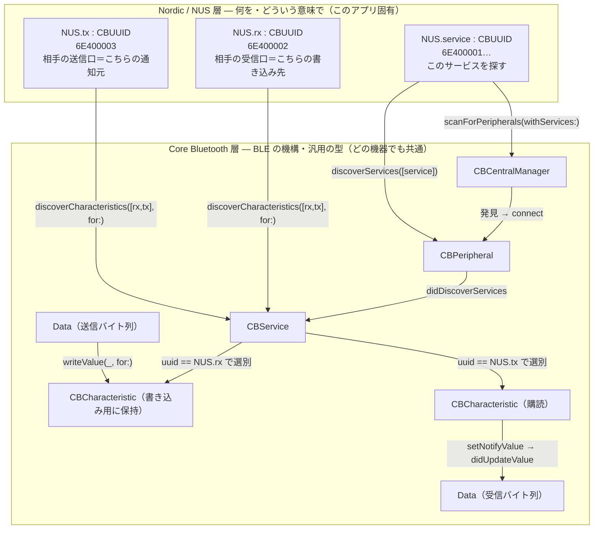
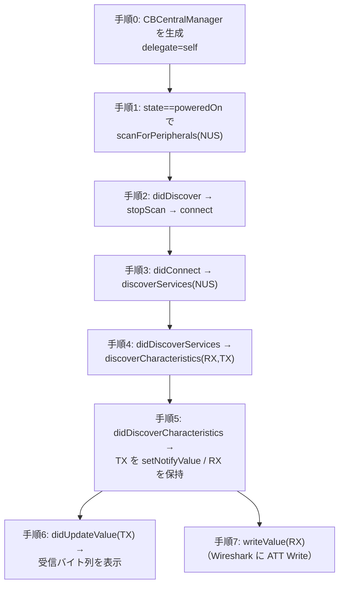

# Core Bluetooth Central 実装ガイド

初学者が **Core Bluetooth の設計思想**を、動く最小コードを読みながら学ぶためのガイド。
題材は `CoreBluetoothCentralGuide/CoreBluetoothCentralGuide/CentralViewController.swift` 1 枚。
peripheral_uart 搭載の nRF52840 DK へ接続し、Nordic UART Service の通信を流す。

一次情報: Apple [About Core Bluetooth](https://developer.apple.com/library/archive/documentation/NetworkingInternetWeb/Conceptual/CoreBluetooth_concepts/AboutCoreBluetooth/Introduction.html) ／ NUS の UUID 定義 [`nus.h`](https://github.com/nrfconnect/sdk-nrf/blob/main/include/bluetooth/services/nus.h)

## 0. まず役割とモデルを掴む

- **役割（Role）**: BLE には 2 つの役がある。**Central**（スキャンして接続しに行くクライアント）と **Peripheral**（アドバタイズしてデータを出すサーバ）。
  - このアプリ ＝ **Central**。相手の DK ＝ **Peripheral**。今回書くのは Central タスクだけ。
- **データの階層（GATT）**: Peripheral のデータは木構造で並ぶ。**Peripheral > Service > Characteristic**。値は Characteristic にあり、そこへ「探索（discover）」してたどり着く。
- **非同期・デリゲート駆動**: `scan` / `connect` / `discover…` はすべて「お願いするだけ」。結果は後でデリゲートのコールバックに返り、**返って初めて次の段へ進む**。この「はしごを 1 段ずつ登る」感覚が Core Bluetooth の核心。
- **状態が先**: Bluetooth が `poweredOn` になるまで何もしない。

> 2 つのデリゲートはどちらも Central 側の話。`CBCentralManagerDelegate` は「マネージャの状態・発見・接続」、`CBPeripheralDelegate` は「接続した“相手”の GATT 探索・値」。`CBPeripheralManager`（自分が Peripheral になる役）は今回は使わない（それは DK のファームが担当）。

### 層の分け方: Core Bluetooth と Nordic/NUS

このサンプルには出自の違う 2 系統の型が出てくる。**Nordic（NUS）が決めるのは「何を・どんな意味で」**（UUID と RX/TX の意味）、**Core Bluetooth が扱うのは「機構と汎用の型」**（Manager・Peripheral・Service・Characteristic・Data）。

ルール: **Nordic 固有の語（NUS・RX・TX・UUID）は `enum NUS` の中だけに閉じ込め、その外は Core Bluetooth／汎用の語で書く。** 接点は 2 つだけ — ① 入口で `NUS.*`（CBUUID）を Core Bluetooth の操作に渡す、② 返ってきた `CBCharacteristic` の `uuid` を `NUS.rx`／`NUS.tx` と照合して役割を決める。それ以降のデータ授受は `CBCharacteristic` と `Data` だけで完結する。だから**保持する状態は `CBPeripheral` ＋ 書き込み用 `CBCharacteristic` だけ**（購読は登録すれば届くので保持不要）。

## 1. はしご（このサンプルがたどる手順）

各手順はコード内の `【0】`〜`【7】` コメントと 1:1 で対応する。

## 2. 各手順の意味

| 手順 | 呼ぶ API | 結果が返るデリゲート | ねらい |
| --- | --- | --- | --- |
| 0 | `CBCentralManager(delegate:queue:)` | — | Central の入口。状態・発見・接続の窓口を開く。 |
| 1 | `scanForPeripherals(withServices:)` | `didDiscover` | poweredOn を待ってから、**必要な Service だけ**でスキャン。 |
| 2 | `stopScan()` / `connect(_:)` | `didConnect` | 見つけたら止めて接続。`peripheral.delegate=self` で GATT の窓口も開く。 |
| 3 | `discoverServices(_:)` | `didDiscoverServices` | 接続後、欲しい Service を探索。 |
| 4 | `discoverCharacteristics(_:for:)` | `didDiscoverCharacteristics` | Service の中の Characteristic を探索。 |
| 5 | `setNotifyValue(true,for:)` | `didUpdateValue`（以降） | TX を**購読**。RX は writeValue 用に保持。 |
| 6 | （受信） | `didUpdateValueFor` | 届いた値を hex＋UTF-8 で表示。 |
| 7 | `writeValue(_:for:type:)` | （Write） | RX へ書き込み。相手へデータを送る。 |

### なぜ「絞る」のか（手順1・4）
`scanForPeripherals(withServices:)` や `discoverServices`/`discoverCharacteristics` に UUID を渡すと、対象を絞れる。全件スキャン/全探索は遅く電力も食う。**必要なものだけ頼む**のが CB の作法。

### Notify と Read の違い（手順5・6）
- **Notify（`setNotifyValue`）**: 相手が更新したら**push で**届く。peripheral_uart の TX はこれ。
- **Read（`readValue`）**: こちらから**1 回だけ**取りに行く。値が変わらない属性に向く。
- どちらも結果は同じ `didUpdateValueFor` に返る。本サンプルは TX を Notify で購読する。

## 3. View と Wireshark の突き合わせ（検証の要）

このサンプルの画面は [Pulse](https://github.com/kean/Pulse) のコンソール（検索・フィルタ・詳細つき）だけ。各手順の進行に加え、**受信バイト列（手順6）を hex と UTF-8 で表示**する。画面レイアウトは関心の外なので定評ある UI に任せ、コードは BLE に集中する。ログは `LoggerStore.shared.storeMessage(label: "BLE", …)` で流し、コンソールが自動更新する。

- 手順 7 の `writeValue` は、Wireshark（Phase 2 の Sniffer）に **ATT Write Request/Command** として現れる。
- 手順 6 の受信は、Wireshark に **Handle Value Notification** として現れる。
- 画面に出た**同じバイト列**が Sniffer のパケットにも現れることを目で確認する。これで「Swift 実装が実際に出している/受けているバイト」を裏取りできる。

## 4. 動かし方

1. Phase 1 で peripheral_uart を DK に書き込み、広告させておく（`make flash-peripheral`）。
2. Phase 2 で Sniffer を起動しておく（`make capture`）。
3. `make open-central` で Xcode を開き、実機（iPhone）で実行。
4. 画面のログが `【0】…【6】` と進み、Sniffer 側に Advertise → Connect → MTU → GATT Discovery → ATT Write/Notification が並ぶのを確認する。
5. 往復を見るには、DK のシリアル端末に文字を入力する（UART RX → BLE TX Notify → 手順6 に届く）。

## 5. ここから先（発展）

- 接続状態を enum のステートマシンにして堅くする。
- `didUpdateNotificationState` / `didWriteValueFor` でエラー処理を足す。
- 複数 Characteristic・複数機器・再接続を扱う（このあたりから、本リポジトリの README で触れた BLE ライブラリ＝ラッパの“動機”が出てくる）。

最小サンプルとしては、上の 7 手順を 1 枚で読み下せることが何より大事。レイヤやラッパは、それが解決する痛みが出てきてから足せばよい。
