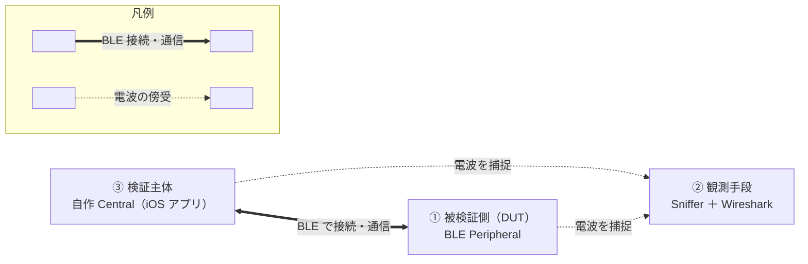
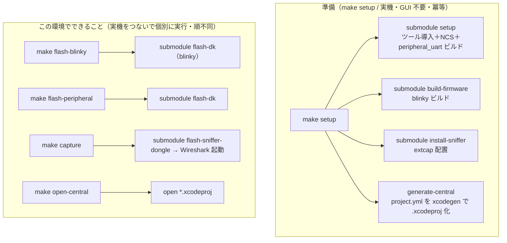
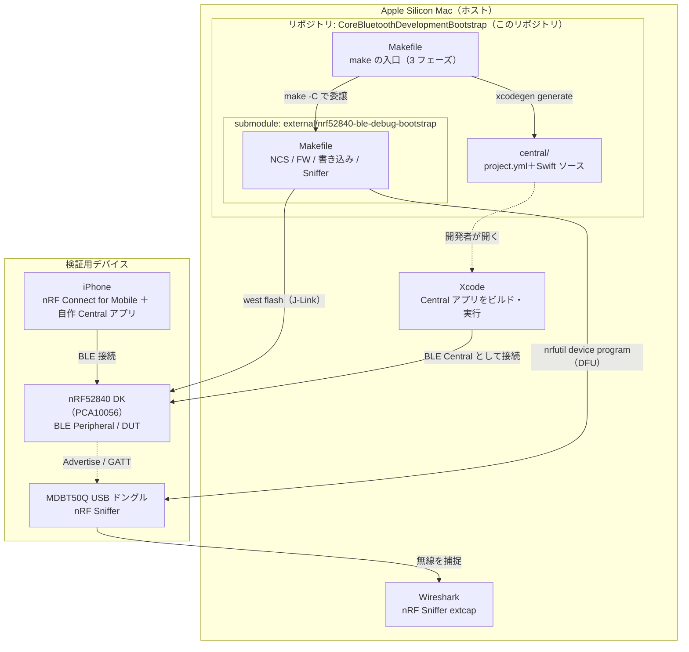
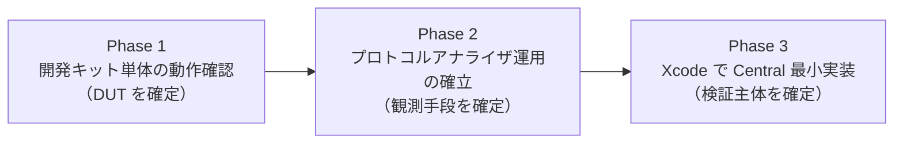
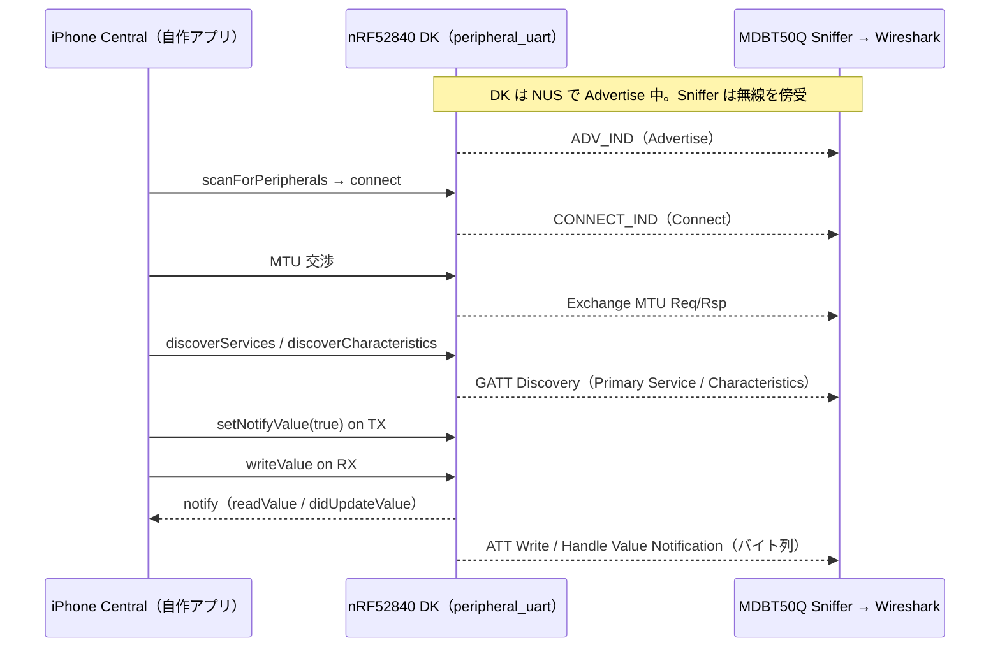

# DESIGN-001 Core Bluetooth（BLE）検証環境 構成設計書

> iOS Central 開発者のための BLE 検証環境を、submodule 構成で自動構築する設計
>
> | 項目 | 内容 |
> | --- | --- |
> | Doc ID | DESIGN-001 |
> | 日付 | 2026-06-03 |
> | 対象ホスト | Apple Silicon Mac |

## 目次

- [用語](#用語)
- [1. 背景と目的](#1-背景と目的)
- [2. Make ターゲット設計](#2-make-ターゲット設計)
- [3. 全体アーキテクチャ](#3-全体アーキテクチャ)
- [4. リポジトリ構成](#4-リポジトリ構成)
- [5. 3 フェーズ設計](#5-3-フェーズ設計)
- [6. 機械検証と人間検証の境界](#6-機械検証と人間検証の境界)
- [意思決定ログ](#意思決定ログ)
- [付録](#付録)

## 用語

本書で独自に使う、意味が取りにくい語を説明する。一般的な技術用語は載せない。

- **準備** — `make setup` 一回で、検証に必要なものを実機もマウス操作も使わずに全部用意する工程。
- **この環境でできること** — 準備のあと、実機をつないで個別に実行する 4 つのコマンド `flash-blinky`・`flash-peripheral`・`capture`・`open-central` の総称。順不同・何度でも実行できる。

## 1. 背景と目的

本リポジトリ `CoreBluetoothDevelopmentBootstrap` は、**Core Bluetooth の検証環境を `make` 一つで用意するリポジトリ**である。

iOS Central 開発者にとっての「BLE 検証環境」は、次の三者が揃って初めて成立する。

1. **被検証側** — 接続相手となる BLE Peripheral
2. **観測手段** — 通信を可視化する Sniffer
3. **検証主体** — 自分が書く Core Bluetooth の Central 実装

この三者は次の図で示す関係にある。



<p align="center"><sub>図 1 — 検証主体 ③ の Central が 被検証側 ① の Peripheral へ BLE で接続して通信し、その電波を 観測手段 ② の Sniffer が傍受して可視化する。</sub></p>

本リポジトリでは、この三者を `make` でまとめて用意する。1 と 2 にあたる nRF ハード固有の立ち上げは submodule という独立リポジトリに閉じ、このリポジトリは三者を 3 フェーズとしてまとめる役と Central 実装の足場を担う。狙いは次の表で示す三点。

| 狙い | 内容 |
| --- | --- |
| **名実の一致** | 「Core Bluetooth 検証環境」を名乗るにふさわしい、Central 実装までを含む全体を提供する。 |
| **関心の分離** | NCS ツールチェーン・ファームウェアビルド・書き込み・Sniffer という nRF ハードの面倒は submodule に閉じ、独立して再利用・進化できる。 |
| **置き換え可能性** | 将来 Peripheral を別ボードや市販の BLE デバイスといった別ハードに差し替えても、このリポジトリ側の 3 フェーズ構造は不変。 |

<p align="center"><sub>表 1 — 二分割の狙いである名実の一致・関心の分離・置き換え可能性。</sub></p>

## 2. Make ターゲット設計

この `make` の使い方は、大きく **「最初に一回やる準備」** と **「そのあと何度でもやる、この環境でできること」** の二段階に分かれる。この使い勝手こそが最重要の設計対象である。

**準備は `make setup` の一回だけである。** `setup` は検証に必要なものを全部まとめて用意する。具体的には、nrfutil や Wireshark 等のツールの導入、nRF Connect SDK の取得、開発キットへ書き込む blinky と peripheral_uart の 2 種類のファームウェアのビルド、Sniffer を Wireshark から使うためのプラグイン配置、そして Xcode の Central プロジェクトの生成までを含む。この準備には実機もマウス操作も要らず、パソコン上で完結する。何度実行しても同じ冪等な状態に行き着くため、途中で失敗しても、設定を変えても、`make setup` を打ち直せば済む。

**準備が終わったら、実機をつないで、この環境でできることを個別のコマンドで試す。** コマンドは次の 4 つである。

- `make flash-blinky` — 開発キットに blinky を書き込み、基板の LED が点滅するのを見る。
- `make flash-peripheral` — 開発キットに peripheral_uart を書き込み、iPhone から接続して文字列が往復するのを見る。
- `make capture` — ドングルに Sniffer を書き込み、Wireshark で電波上のやり取りを覗く。
- `make open-central` — Xcode プロジェクトを開き、自分で書いた Central アプリを動かす。

**この 4 つに決まった実行順序はない。** どれから始めてもよく、同じものを何度繰り返してもよい。たとえば「peripheral_uart を書き込み直して、もう一度キャプチャを取り直す」「Central アプリを直して、また開いて試す」といったことを、好きな順で何度でもできる。ビルドは `setup` で済ませてあるため、これらのコマンドは「書き込む」「開く」だけを担い、すぐ動く。

実装上は、このリポジトリが submodule へ `$(MAKE) -C external/nrf52840-ble-debug-bootstrap <target>` で委譲し、submodule の冪等性をそのまま受け継ぐ。実機への書き込みと GUI 起動は `setup` には一切含めず、これらのコマンド側の役割とする。

### 2.1 ターゲット一覧

| 区分 | ターゲット | 委譲先 / 動作 | 責務 |
| --- | --- | --- | --- |
| — | `help` | — | 既定ゴール。`## 注記`から一覧を自動生成。副作用なし。 |
| 準備 | `init` | `git submodule update --init` | `setup` が内部で呼ぶ、submodule の取得・更新。 |
| 準備 | `setup` | submodule の `setup` ＋ `build-firmware`(blinky) ＋ `install-sniffer` ＋ `generate-central` | **検証に必要なものを全部用意する。** 実機/GUI 不要・冪等。 |
| 準備 | `generate-central` | 同梱 `project.yml` を `xcodegen generate` | `setup`／`open-central` から呼ばれ、iOSAppTemplate 非依存で Central の `.xcodeproj` を生成する。 |
| できること① 開発キット | `flash-blinky` | blinky を上書きした submodule の `flash-dk` | blinky を焼いて LED 点滅を見る。 |
| できること① 開発キット | `flash-peripheral` | submodule の `flash-dk` | peripheral_uart を焼き、nRF Connect で往復を見る。 |
| できること② アナライザ | `capture` | submodule の `flash-sniffer-dongle` ＋ Wireshark 起動 | ドングルに Sniffer を焼き、Wireshark でキャプチャ。 |
| できること③ Central | `open-central` | `open *.xcodeproj` | Xcode プロジェクトを開いてアプリを動かす。 |
| — | `verify` | submodule の `verify` | 読み取り専用＋[y/N]書込確認の機械検査。 |
| — | `clean` | submodule の `clean` ＋ このリポジトリの `build/` 削除 | central プロジェクトは残し、ビルド成果物を削除。 |

<p align="center"><sub>表 2 — make ターゲット一覧。区分・委譲先・責務を示す。</sub></p>

### 2.2 準備と「この環境でできること」のグラフ

`make setup` が 4 つの準備ステップへ扇状に展開し、各コマンドは独立に submodule へ委譲する。



<p align="center"><sub>図 2 — make setup が 4 つの準備ステップへ展開し、各コマンドは独立に submodule へ委譲する。</sub></p>

### 2.3 冪等性と実行順序

- `setup` の各ステップは submodule のガードと `generate-central` の存在検査という状態検査つきで冪等。再実行は同一状態へ収束する。
- 各コマンドは**独立・再入可能**で、決まった順序を持たない。FW の再書き込みは結果状態を変えないため実質冪等。`open-central` は何度開いてもよい。`generate-central` は同梱 `project.yml` から `xcodegen` で `.xcodeproj` を何度でも冪等に再生成できる。

## 3. 全体アーキテクチャ

### 3.1 リポジトリ二分割

| リポジトリ | 役割 | 提供物 |
| --- | --- | --- |
| **`CoreBluetoothDevelopmentBootstrap`** — このリポジトリ | Core Bluetooth 検証環境を `make` で用意する。3 フェーズをまとめ、Central 実装の足場まで用意する。 | Makefile、本設計書、project.yml＋Swift から成る Central のソース、submodule の取り込み |
| **`kokiTakashiki/nrf52840-ble-debug-bootstrap`** — submodule | Peripheral と Sniffer から成る nRF52840 製の BLE デバッグ環境。NCS 導入・FW ビルド・実機書き込み・Sniffer を冪等に自動化する。 | 13 ターゲットの既存 Makefile、README、CI、LICENSE |

<p align="center"><sub>表 3 — リポジトリ二分割の役割と提供物。</sub></p>

### 3.2 コンポーネント関係



<p align="center"><sub>図 3 — このリポジトリ・submodule・DK・ドングル・iPhone といった検証用デバイスの構成と、書き込み・接続・観測の経路。</sub></p>

### 3.3 submodule を選ぶ理由

取り込む方式は submodule とする。要点は、**submodule のコミットをこのリポジトリが明示的にピン留めでき、submodule が独立リポジトリとして単体でも使える**こと。

## 4. リポジトリ構成

```text
CoreBluetoothDevelopmentBootstrap/        # このリポジトリ
├── Makefile                              # make の入口（3 フェーズ）
├── README.md                             # 使い方・コマンド一覧
├── LICENSE                               # MIT
├── .gitmodules                           # submodule の宣言
├── docs/
│   └── DESIGN-001.md                     # 本書（構成設計書）
├── external/
│   └── nrf52840-ble-debug-bootstrap/     # submodule
│       ├── Makefile                      #   環境構築 Makefile（13 ターゲット）
│       ├── README.md
│       ├── LICENSE
│       └── .github/workflows/idempotency.yml
├── central/                              # Phase 3 用（Central のソースを同梱）
│   └── BLECentralSample/                 #   project.yml ＋ Swift ソース（commit）
│       ├── project.yml                   #     XcodeGen 定義（.xcodeproj の source of truth）
│       └── BLECentralSample/*.swift      #     AppDelegate/SceneDelegate/VC/BLECentral
│           # .xcodeproj・Info.plist は xcodegen 生成・.gitignore
└── .github/
    └── workflows/                        # このリポジトリの機械ゲート（parse-lint など）
```

`.gitmodules` の宣言:

```ini
[submodule "external/nrf52840-ble-debug-bootstrap"]
    path = external/nrf52840-ble-debug-bootstrap
    url = https://github.com/kokiTakashiki/nrf52840-ble-debug-bootstrap.git
```

## 5. 3 フェーズ設計

検証は次の 3 フェーズを順に確定させる。各フェーズは「目的 → Makefile が自動化する範囲 → 人間が行う確認 → 完了条件」で定義する。**実機の目視や GUI 操作といった人間の確認はフェーズの完了条件には含むが、Makefile の責務には含めない**。詳細は [6 章](#6-機械検証と人間検証の境界)に示す。



<p align="center"><sub>図 4 — 検証は 3 フェーズを順に確定させる。順序は DUT → 観測手段 → 検証主体。</sub></p>

### 5.1 Phase 1 — 開発キット単体の動作確認

**目的:** nRF52840 DK が正常な BLE Peripheral として動作する状態を確定する。

| 手順 | Makefile の自動化 | 人間の確認 |
| --- | --- | --- |
| Nordic 公式 Getting Started に従い blinky を書き込み | ○ submodule の `flash-dk` を blinky サンプルへ変数上書きして実行 | LED が点滅していること |
| Nordic UART Service の peripheral_uart を書き込み | ○ 既定サンプルである submodule の `flash-dk` | — |
| iPhone の nRF Connect for Mobile から接続し文字列の往復を確認 | × GUI 操作のため対象外 | RX/TX で文字列が往復すること |

<p align="center"><sub>表 4 — Phase 1 の手順と、Makefile の自動化範囲および人間の確認。</sub></p>

**blinky の実現という重要な設計判断:** submodule の Makefile の `build-firmware` / `flash-dk` は `SAMPLE_DIR` と `BUILD_DIR` を変数化している。blinky は NCS ソースツリー内の `zephyr/samples/basic/blinky` に存在するため、**submodule に新ターゲットを追加せず**、変数上書きだけで書き込める。

```bash
# flash-blinky / setup が内部で実行するイメージ
$(MAKE) -C external/nrf52840-ble-debug-bootstrap flash-dk \
    SAMPLE_DIR='$(NCS_BASE)/zephyr/samples/basic/blinky' \
    BUILD_DIR='$(CURDIR)/build/blinky'
```

これにより blinky 用ビルドが `build/` の peripheral_uart 用ビルドと別ディレクトリに分離され、両者が共存できる。

**完了条件:** blinky で LED 点滅を確認し、peripheral_uart 書き込み後に nRF Connect for Mobile で文字列の往復が取れること。これをもって被検証側を確定する。

### 5.2 Phase 2 — プロトコルアナライザ運用の確立

**目的:** 開発キットと iPhone の BLE 通信を観測できる状態を確定する。

| 手順 | Makefile の自動化 | 人間の確認 |
| --- | --- | --- |
| ドングルに nRF Sniffer FW を書き込み | ○ submodule の `flash-sniffer-dongle` で DFU 実行。Open Bootloader への移行は [y/N] 確認つき | — |
| Wireshark の extcap ディレクトリにキャプチャプラグインを配置 | ○ `nrfutil ble-sniffer bootstrap` を行う submodule の `install-sniffer` | — |
| Wireshark のインタフェース一覧に「nRF Sniffer for Bluetooth LE」が出現することを確認 | △ submodule の `verify` が実施し、`tshark -D` に sniffer が現れるかを機械判定可 | Wireshark GUI 上での表示 |
| Advertise → Connect → MTU 交渉 → GATT Discovery の各フェーズを観測 | × キャプチャの読解のため対象外 | 各フェーズがキャプチャに現れること |

<p align="center"><sub>表 5 — Phase 2 の手順と、Makefile の自動化範囲および人間の確認。</sub></p>

**完了条件:** Wireshark に Sniffer インタフェースが現れ、DK ↔ iPhone 通信で Advertise → Connect → MTU 交渉 → GATT Discovery の各フェーズが観測できること。これをもって観測手段を確定する。

### 5.3 Phase 3 — Xcode で Central 最小実装

**目的:** 自作の Core Bluetooth Central が、Phase 1 で確定した peripheral_uart 搭載 DK と一連の手順で通信できる状態を確定し、その通信を Phase 2 の Sniffer で裏取りする。

| 手順 | Makefile の自動化 | 人間の確認 |
| --- | --- | --- |
| Xcode 新規プロジェクトを作成。雛形は [iOSAppTemplate](https://github.com/koki-mobile-studio/iOSAppTemplate) で一度生成し固定済み | ○ `generate-central`：同梱の `project.yml` を `xcodegen generate` で `.xcodeproj` 化 | — |
| `CBCentralManager` / `CBCentralManagerDelegate` / `CBPeripheralDelegate` の最小実装 | ○ アプリ内蔵で `BLECentral.swift`／`BLECentralViewController.swift` を同梱。署名・実行は開発者 | コードを読み・実機で動かす |
| `scan → connect → discoverServices → discoverCharacteristics → readValue/setNotifyValue` の一連動作 | × 実機ビルド・署名・実行のため対象外 | アプリ上で一連が流れること |
| 同一通信を Wireshark で観測し、Swift 実装が出すバイト列を可視化 | × キャプチャの読解のため対象外 | Sniffer 上で Swift 由来のバイト列が見えること |

<p align="center"><sub>表 6 — Phase 3 の手順と、Makefile の自動化範囲および人間の確認。</sub></p>

接続先は Phase 1 で構築した peripheral_uart 搭載 DK とする。

**Phase 3 のエンドツーエンドである Central の最小フロー:**



<p align="center"><sub>図 5 — 自作 Central と DK の一連の通信である scan→connect→MTU→GATT→notify を Sniffer が傍受する。</sub></p>

**完了条件:** 自作 Central が DK と上記フローを完走し、同じ通信が Wireshark 上でも観測できること。これをもって検証主体を確定し、Core Bluetooth 検証環境の構築を完了とする。

**iOSAppTemplate の扱いという設計判断:** iOSAppTemplate は Genesis ベースのテンプレートで、XcodeGen `project.yml` を含むアプリ一式の雛形を生成する。これを**一度だけ**使って雛形を作り、その source of truth である `project.yml` と Swift ソースをこのリポジトリに固定する。**`make` 実行時に iOSAppTemplate へは依存しない**ため、テンプレが破壊的に変わっても影響を受けない。`make generate-central` は同梱の `project.yml` を `xcodegen generate` するだけ。追跡するのは `project.yml` と Swift ソースで、生成物である `.xcodeproj`・`Info.plist` は `.gitignore` する。

## 6. 機械検証と人間検証の境界

本設計は「事実に判定させる」方針に従い、**機械のみで完結する検証**と**人間に委ねる確認**を明示的に分離する。CI が回すのは前者だけである。

| 区分 | 内容 | 担い手 |
| --- | --- | --- |
| CI の機械ゲート | このリポジトリの Makefile の全ターゲットが dry-run でパースできる／既定ゴールが副作用のない `help` である／`.gitmodules` の URL が宣言と一致する／submodule パスが存在する | GitHub Actions |
| 実機・任意の機械検証 | submodule の `verify` で、`tshark -D` に Sniffer が出現するか、BLE トラフィックを検出できるかを判定 | 要実機の `make verify` |
| 人間の確認 | LED 点滅・nRF Connect での文字列往復・Wireshark GUI 上のフェーズ観測・Xcode でのアプリ実行 | 開発者 |

<p align="center"><sub>表 7 — 機械検証と人間検証の担い手の分離。</sub></p>

> Phase 3 の Xcode ビルド・iOS 実機署名・アプリ実行は GUI と手動承認を要し、Make の冪等性が保証できないため自動化対象外とする。これは submodule の Makefile が Xcode を対象外としている方針を、このリポジトリでも踏襲するものである。

> **CI の所在:** nRF Makefile の 13 ターゲットを検証するテストである `.github/workflows/idempotency.yml` は submodule 側に置き、対象 Makefile と同居させる。このリポジトリには別物の CI として、Makefile の dry-run パース ＋ `.gitmodules` の URL/パス整合チェックを置く。両者はターゲット体系が異なるため分離している。

## 意思決定ログ

解決した選択を一元的に記録する。同じ論点を二度蒸し返さない。

| ID | 決定事項 | 理由 / 背景 |
| --- | --- | --- |
| D-1 | リポジトリを「Core Bluetooth 検証環境を `make` で用意するこのリポジトリ」と「submodule である nRF52840 製 BLE デバッグ環境」の 2 つに分割する | 旧構成は Core Bluetooth という名前と nRF ハードのセットアップという実体が乖離していた。Central 実装を含む全体をこのリポジトリがまとめ、ハード固有の面倒は submodule に閉じることで、名実を一致させ、submodule を独立再利用可能にする。 |
| D-2 | 取り込みは subtree / コピー / パッケージ依存ではなく **submodule** とする | submodule のコミットをこのリポジトリが明示的にピン留めでき、再現性が高い。submodule は独立リポジトリとして単体でも使え、公開する価値がある。subtree は履歴がこのリポジトリに混入し独立性が薄れる。単純コピーは更新追従ができない。パッケージ化は Makefile 配布に対して過剰。 |
| D-3 | 旧 `docs/DESIGN-001.md` は submodule へ移設せず破棄し、本書で全面的に置き換える | 旧文書は文体が不安定で設計書として使えないとのユーザー指摘による判断。submodule には README で足りるため設計書を持たせず、このリポジトリに唯一の設計書として本書を置く。 |
| D-4 | 検証フローを DUT 確定 → 観測手段確定 → 検証主体確定の 3 フェーズに構造化する | BLE 検証は「対向・観測・主体」の三者が揃って初めて成立する。各フェーズに明確な完了条件を与えることで、どこまで確定したかを段階的に保証できる。 |
| D-5 | Phase 1 の blinky は submodule の新ターゲットではなく、既存 `flash-dk` の `SAMPLE_DIR` / `BUILD_DIR` 変数上書きで実現する | submodule の Makefile は両変数を既に変数化しており、`zephyr/samples/basic/blinky` の blinky を別 `BUILD_DIR` でビルド・書き込みできる。submodule を無改変に保て、peripheral_uart 用ビルドと共存できる。**代替案**として submodule に `flash-blinky` 専用ターゲットを追加する案は submodule の改変を伴い、変数上書きで足りる以上は不採用。 |
| D-6 | Phase 3 は「`.xcodeproj` 生成まで」を Makefile の責務とし、Xcode ビルド・署名・実行は人間に委ねる | Apple の署名フローは GUI と手動承認を要し、Make の冪等性を保証できない。これは submodule の Makefile が Xcode を対象外としてきた方針の踏襲である。`generate-central` で `xcodegen` による `.xcodeproj` 化までを機械化し、以降の実機署名・ビルド・実行は開発者が担う。 |
| D-7 | `project.yml` ＋ Swift ソースの Central アプリをこのリポジトリに固定し、`.xcodeproj` だけを `xcodegen` で生成する。**`make` 実行時に iOSAppTemplate へは依存しない** | iOSAppTemplate は Genesis テンプレで、XcodeGen `project.yml` を含むアプリ一式の雛形を生成する。当初案は `make` 実行のたびに iOSAppTemplate を clone して Genesis 生成していたが、**テンプレは破壊的に変更され得るため、実行時依存は壊れやすい**とユーザーが指摘した。そこで iOSAppTemplate で一度だけ雛形を生成し、その source of truth である `project.yml`・`AppDelegate`/`SceneDelegate`/`BLECentralViewController`・`BLECentral.swift` をこのリポジトリに固定。以後 iOSAppTemplate を参照せず、`make generate-central` は同梱 `project.yml` を `xcodegen generate` するだけ。commit するのは `project.yml` と Swift ソース、生成物の `.xcodeproj`・`Info.plist` は `.gitignore`。種別: ユーザー指摘と依存削減による実装方針。 |
| D-8 | このリポジトリは submodule へ `$(MAKE) -C` で委譲し、submodule の冪等性と setup・deploy・verify の関心分離をそのまま継承する | submodule は冪等性と書き込み/検証分離を作り込み済み。このリポジトリはそれを再発明せず、まとめて呼び出すだけにとどめ、二重実装と挙動のずれを防ぐ。 |
| D-9 | CI が回す dry-run パース・submodule 整合の機械検証と、LED・GUI・実機実行の人間確認を設計段階で明示分離する | 「事実に判定させる」方針。検証可能なものは CI が判定し、目視・GUI 操作は人間の完了条件として記すが Makefile の責務には含めない。重い実機・数 GB DL・GUI は CI 非対象とする。 |
| D-10 | `make` インターフェースを「**`make setup` 一回の準備 ＋ 独立した 4 コマンドのこの環境でできること**」の二段階にする | 最重要の設計対象は `make` の使い勝手そのものである。当初案は `phase1/2/3` が、ビルド・配置・生成の準備と、書き込み・GUI 起動による実機で動かす操作を 1 ターゲットに混在させ、`setup` も 3 環境のうち peripheral_uart の 1 つしか用意していなかった。ユーザー指摘により、`make setup` 一回で blinky/peripheral_uart ビルド・Sniffer extcap・Xcode プロジェクトまで**全部を冪等に用意**し、以降は `flash-blinky` / `flash-peripheral` / `capture` / `open-central` の 4 コマンドを**順不同・何度でも**叩いて確かめられる形へ再設計。「この環境でできること」は開発キットを blinky と peripheral に分けて細分化し、命名は動作が一目で分かる動詞＋対象とした。種別: ユーザー指摘で承認済みの UX / インターフェース設計。 |

<p align="center"><sub>表 8 — 解決した選択を記録する意思決定ログ。</sub></p>

## 付録

本書は、構成・責務分割・Make ターゲット設計・検証範囲を定義する現状の原典である。経緯・選択の理由は[意思決定ログ](#意思決定ログ)に集約する。
