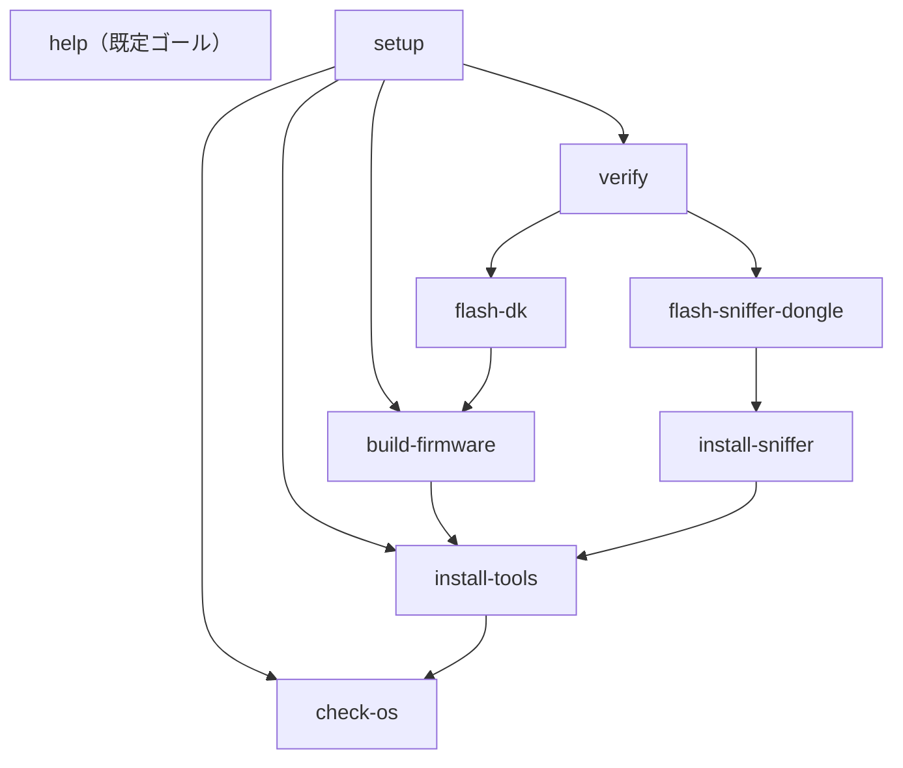

# DESIGN-001 環境構築 Makefile 設計書

> Core Bluetooth 検証環境を冪等に構築する自動化レイヤの設計
>
> | 項目 | 内容 |
> | --- | --- |
> | Doc ID | DESIGN-001 |
> | 日付 | 2026-06-02 |
> | 対象 | Apple Silicon Mac |

**スコープ:** nRF Connect SDK、Wireshark、nRF Sniffer、Python 依存、ファームウェア書き込みまでの一連の環境構築を Make ターゲットとして定義する。

**対象外:** Xcode および iOS 実機署名の自動化は対象外とする。Apple の署名フローは GUI 操作と手動承認を要するため、Make の冪等性が保証できないことが理由である。

## 章立て

| No | 章 | 目標規定文 |
| --- | --- | --- |
| 1 | 概要 | 本設計書が定義する対象と、Makefile を採用する理由を述べる。 |
| 2 | 冪等性の定義と担保方式 | 本設計における冪等性の定義と、それを Make でどう実現するかを述べる。 |
| 3 | ターゲット設計 | 各 Make ターゲットの責務と依存関係を定義する。 |
| 4 | 変数とガード設計 | 環境差を吸収する変数と、再実行時の安全性を担保するガード条件を定義する。 |
| 5 | 依存グラフ | ターゲット間の依存関係を有向グラフとして示す。 |
| 6 | 失敗時の挙動 | 各ターゲットが失敗した場合の回復方針を定義する。 |
| 7 | 結論 | 本設計の要点と、実装フェーズへの引き継ぎ事項をまとめる。 |
| — | 意思決定ログ | 解決した選択を一元的に記録し、二度蒸し返さない。 |

## 1. 概要

本設計書は、Core Bluetooth 検証環境の構築を Make ターゲットとして定義し、何度実行しても同一の最終状態に収束する自動化レイヤを設計するものである。

Make を採用する理由は三点ある。第一に、ターゲット間の依存関係を宣言的に記述でき、必要なタスクのみが実行される点。第二に、シェルスクリプトの羅列と比較して、再実行時の差分制御を構造的に表現できる点。第三に、追加のランタイムを要さず、macOS に標準搭載される点である。

## 2. 冪等性の定義と担保方式

本設計における冪等性とは「同一の入力に対し、Make ターゲットを何度実行しても最終状態が変化しない」ことと定義する。これを担保する方式は、各ターゲットの冒頭で現在状態を検査し、目標状態と一致する場合は副作用のある処理を実行しないことである。

| ガード条件 | 判定方法 | 効果 |
| --- | --- | --- |
| ツール存在検査 | `command -v` または対応するバージョン問い合わせコマンドの終了コード | 導入済みなら導入処理をスキップ |
| ファイルハッシュ比較 | 配置元と配置先の `shasum` を比較 | 一致時は再配置しない |
| ビルド差分検査 | `west build` のインクリメンタル機構 | ソース未変更時は再コンパイルしない |
| デバイス接続検査 | シリアルポート / J-Link の存在確認 | 未接続時は明示エラーで即停止 |

> ファームウェア書き込みは厳密には非冪等な操作である。ただし、同一ファームウェアの再書き込みはデバイスの結果状態を変えないため、本設計では実質的に冪等とみなす（→ 意思決定ログ DL-1）。

## 3. ターゲット設計

すべてのターゲットは `.PHONY` 指定とし、同名ファイルの有無に挙動が左右されないようにする。**既定ゴールは副作用を持たない `help`** とし、導入・ビルド・実機書き込みを伴う `setup` は明示的に `make setup` と打たせる（→ 意思決定ログ DL-3）。

| ターゲット | 依存先 | 責務 | 冪等性の担保 |
| --- | --- | --- | --- |
| `help` | — | **既定ゴール。** 各ターゲットの `## 注記` から一覧を自動生成して表示する。副作用を持たない。 | 読み取り専用。状態を変更しない。 |
| `setup` | check-os, install-tools, build-firmware, verify | 前提確認から検証までを一括実行する（明示呼び出し）。各依存ターゲットが個別に冪等であるため setup の再実行も冪等。 | 依存先がすべて冪等であることに依存する。setup 自体は状態を持たない。 |
| `check-os` | — | 実行環境が Apple Silicon Mac であることを確認する。`uname -m` が arm64 を返すこと、Homebrew が存在することを検査する。 | 読み取り専用の検査のみ。本質的に冪等。 |
| `install-tools` | check-os | nrfutil / NCS Toolchain / Wireshark / Python 依存(west) を導入する。各ツールの導入有無を事前検査し、未導入のもののみ導入する。nrfutil は Nordic 公式 arm64 バイナリを直接取得する（→ DL-4）。 | 導入前に存在検査。導入済みならスキップし重複導入が発生しない。nrfutil の判定は `nrfutil --version` の終了コードで行い、壊れた symlink を誤検出しない。 |
| `install-sniffer` | install-tools | nRF Sniffer の extcap プラグインを Wireshark のプラグインディレクトリへ配置する。 | 配置先のファイルハッシュを比較し、一致時は再配置しない。 |
| `build-firmware` | install-tools | peripheral_uart サンプルをビルドする。 | `west build` のインクリメンタルビルド機構に委ねる。ソース未変更時は再コンパイルしない。 |
| `flash-dk` | build-firmware | ビルド済みファームウェアを開発キットへ書き込む。J-Link を検出し、未接続時は明示エラーで停止する。 | 同一ファームウェアの再書き込みは結果状態を変えないため実質冪等。 |
| `flash-sniffer-dongle` | install-sniffer | USB ドングルへ nRF Sniffer ファームウェアを書き込む。Open Bootloader 経由の DFU を用いる。 | 同一ファームウェアの再書き込みは結果を変えない（実質冪等）。 |
| `verify` | flash-dk, flash-sniffer-dongle | DK が BLE Peripheral として広告していること、Wireshark に Sniffer インタフェースが出現していることを検査する。 | 読み取り専用の検査のみ。状態を変更しない。 |
| `clean` | — | ビルド成果物を削除する。導入済みツールや書き込み状態には干渉しない。 | 対象が存在しない場合も `rm -rf` により正常終了する。 |

## 4. 変数とガード設計

環境差を吸収する変数。いずれもコマンドライン引数での上書きを許容し、未指定時は安全側の既定値を採る。

| 変数 | 既定値 | 用途 |
| --- | --- | --- |
| `NCS_VERSION` | `v2.6.1` | nRF Connect SDK のバージョン固定。バージョン不整合に起因するビルド失敗を防ぐ。 |
| `BOARD` | `nrf52840dk_nrf52840` | ビルド対象ボードの指定。 |
| `SNIFFER_HEX` | 配布物のパス | Sniffer ファームウェアのパス。nRF Sniffer 配布物のバージョンに追随する。 |
| `WIRESHARK_EXTCAP_DIR` | `~/.local/lib/wireshark/extcap` | extcap プラグインの配置先（macOS のユーザー領域パス）。 |
| `SERIAL_PORT` | 自動検出 | 書き込み対象シリアルポート。未指定時は自動検出を試み、複数検出時はエラーで停止する。 |

## 5. 依存グラフ

矢印は「依存元 → 依存先」を表し、依存先が先に実行される。`help` は既定ゴールだが依存を持たない独立ノードである。

## 6. 失敗時の挙動

失敗時は副作用を残さず即停止し、再実行により回復可能な状態を保つ。

| ターゲット | 失敗条件 | 回復方針 |
| --- | --- | --- |
| `check-os` | arm64 でない、または Homebrew 不在 | 明示メッセージを出力し即停止。後続を実行しない。 |
| `install-tools` | ネットワーク断、バージョン取得失敗 | 失敗ツール名を表示。再実行で導入済み分はスキップし未導入分のみ再試行。 |
| `build-firmware` | SDK と Toolchain のバージョン不整合 | west のエラーログを表示。`NCS_VERSION` の固定値を確認する旨を案内。 |
| `flash-dk` | 開発キット未接続、シリアルポート曖昧 | 検出結果を表示し停止。`SERIAL_PORT` の明示指定を促す。 |
| `verify` | 広告未検出、Sniffer インタフェース不在 | どの検査が失敗したかを表示。flash 系ターゲットの再実行を案内。 |

## 7. 結論

本設計の要点は、各ターゲットを状態検査つきの冪等な単位として定義し、依存グラフによって必要最小限の実行に限定することである。これにより、環境構築を何度繰り返しても同一の最終状態へ収束する。

実装フェーズへの引き継ぎ事項:

1. ファームウェア書き込みの冪等性は物理的摩耗を無視する前提に立つため、頻繁な再書き込みを伴う運用では別途検討を要する（DL-1）。
2. Xcode 側の署名フローは本 Makefile の対象外であり、手動手順として別途記録する必要がある。

## 意思決定ログ

解決した選択を一元的に記録する。自律判断・エスカレーションを問わず、ここに集約して同じ論点を二度と蒸し返さない。

| ID | 決定事項 | 理由 / 背景 | 種別 |
| --- | --- | --- | --- |
| DL-1 | ファームウェア書き込みを「実質冪等」とみなす | 同一 FW の再書き込みは結果状態を変えない。書き込み回数に依存する物理的摩耗は無視できるという前提に基づく（意見）。 | 設計前提 |
| DL-2 | 各レシピを単一シェルチェーンに集約する | macOS 標準の GNU Make 3.81 は `.ONESHELL` / `.SHELLFLAGS` を非対応（3.82+ で追加）。レシピ行をまたいだシェル変数共有は壊れるため、検査ロジックを 1 シェルに閉じる。`gmake` 3.82+ でも整合。 | 実装制約 |
| DL-3 | 既定ゴールを `setup` から `help` に変更する | 当初設計は「先頭ターゲット＝既定」の慣習に従い `setup` を既定にしていたが、素の `make` が導入・ビルド・**実機書き込み**まで一括実行するのは誤実行の事故リスクが高い。副作用のない `help` を既定にし、一括実行は明示 `make setup` に限定する。これはモダンな Makefile の慣習（self-documenting help）にも合致する。 | UX / 既定挙動（ユーザー承認済み） |
| DL-4 | nrfutil を Homebrew cask ではなく Nordic 公式バイナリの直接取得で導入する | `brew install --cask nrfutil` は **deprecated かつ macOS Gatekeeper チェックに失敗**し、実体バイナリを伴わない壊れた symlink を残す（`brew` は「installed」と記録するが `nrfutil` は実行不可）。これにより `make setup` が `command not found` (Error 127) で失敗した。対策として、Nordic 公式 Artifactory (`files.nordicsemi.com`) の arm64 ネイティブバイナリを `curl -fL` で取得し、`chmod +x` + quarantine 除去のうえ `$(brew --prefix)/bin` へ配置する（sudo 不要）。導入判定は `command -v` ではなく `nrfutil --version` の終了コードで行い、壊れた symlink を「導入済み」と誤検出しない。 | 実装バグ修正（実機検証で発覚） |

> **注:** DL-4 のダウンロード URL は調査時に実機で取得・`file` により arm64 ネイティブと確認済み（推測 URL ではない）。なお `nrfutil` バイナリの取得・実行はユーザー自身が `make` を実行する際にユーザー権限で行われる。`flash-sniffer-dongle` が用いる `nrfutil pkg` / `nrfutil dfu` は旧 pc-nrfutil 系の構文であり、新 unified nrfutil では別コマンド体系になる点は別途要対応（ハードウェア接続時に検証）。

> **注:** DL-3 は当初設計（`setup` を既定として冒頭配置）からの逸脱である。実装・レビュー段階でのユーザー判断により決定し、本設計書を実装に追従させた。
