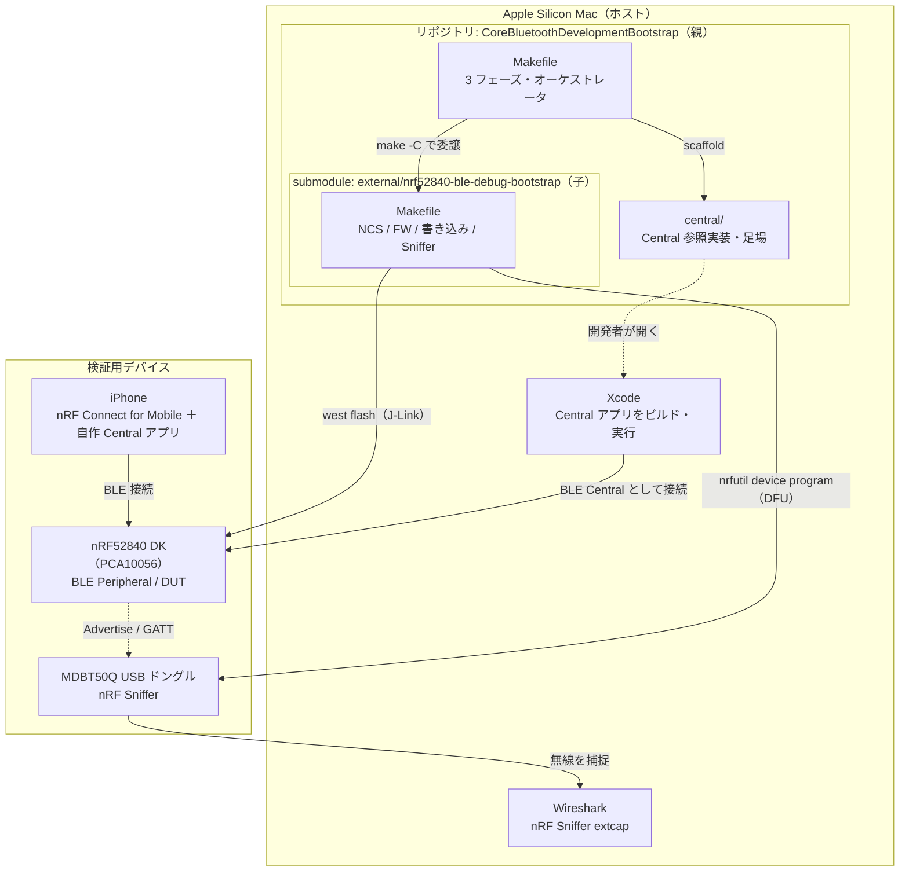
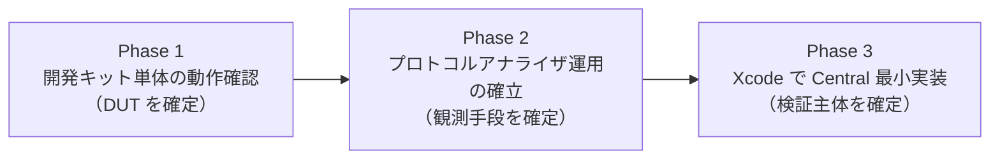
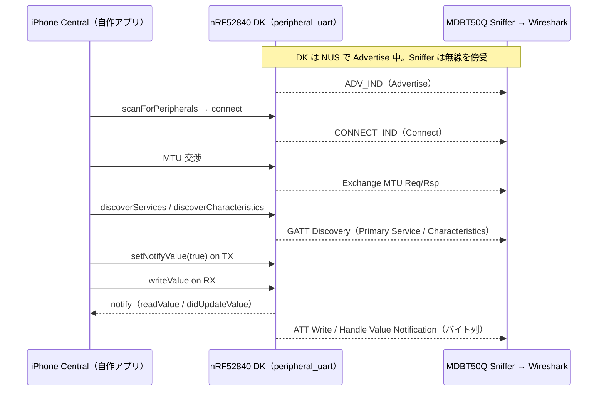
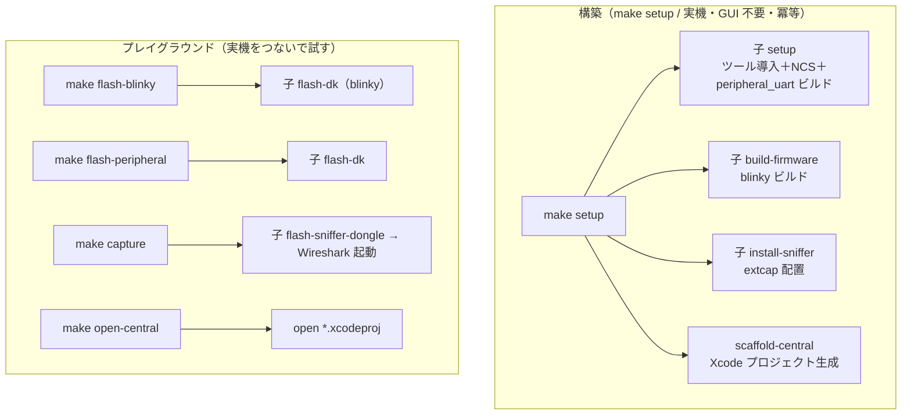

# DESIGN-001 Core Bluetooth（BLE）検証環境 構成設計書

> iOS Central 開発者のための BLE 検証環境を、submodule 構成で自動構築する設計
>
> | 項目 | 内容 |
> | --- | --- |
> | Doc ID | DESIGN-001 |
> | 日付 | 2026-06-03 |
> | 対象ホスト | Apple Silicon Mac |
> | 位置づけ | リポジトリ再設計（旧 DESIGN-001 を破棄し、本書で全面的に置き換える） |

## このドキュメントの目的

本リポジトリ `CoreBluetoothDevelopmentBootstrap` を、**Core Bluetooth（BLE）の検証環境を自動構築するオーケストレータ**として再設計する。その構成・責務分割・Make ターゲット設計・検証範囲を定義し、実装フェーズへ引き継ぐ。

## 1. 背景と再設計の動機

### 1.1 旧構成の問題

旧リポジトリは「Core Bluetooth（BLE）の検証環境を自動構築する Makefile を提供する」と謳っていたが、実体は **nRF52840 DK（PCA10056）と nRF52840 MDBT50Q USB ドングルのセットアップに閉じていた**。すなわち「対向に置く Peripheral と、通信を覗く Sniffer」を立ち上げるだけで、肝心の **iOS Central 側（Core Bluetooth そのもの）が検証フローに含まれていなかった**。

iOS Central 開発者にとっての「BLE 検証環境」は、次の三者が揃って初めて成立する。

1. **被検証側（DUT）** — 接続相手となる BLE Peripheral
2. **観測手段** — 通信を可視化するプロトコルアナライザ（Sniffer）
3. **検証主体** — 自分が書く Core Bluetooth の Central 実装

旧構成は 1 と 2 だけを提供しており、名前（Core Bluetooth）と実体（nRF ハードのセットアップ）が乖離していた。

### 1.2 再設計の方針

nRF ハード固有の立ち上げ（1 と 2）を独立リポジトリへ切り出し、submodule として取り込む。本リポジトリは三者を束ねる **3 フェーズのオーケストレータ**に専念する。これにより、

- **名実の一致** — 本リポジトリは「Core Bluetooth 検証環境」を名乗るにふさわしい、Central 実装までを含む全体を提供する。
- **関心の分離** — nRF ハードの面倒（NCS ツールチェーン・ファームウェアビルド・書き込み・Sniffer）は子リポジトリに閉じ、独立して再利用・進化できる。
- **置き換え可能性** — 将来 Peripheral を別ハード（別ボード／市販の BLE デバイス）に差し替えても、オーケストレータ側の 3 フェーズ構造は不変。

## 2. 全体アーキテクチャ

### 2.1 リポジトリ二分割

| リポジトリ | 役割 | 提供物 |
| --- | --- | --- |
| **`CoreBluetoothDevelopmentBootstrap`**（本リポジトリ／親） | Core Bluetooth 検証環境のオーケストレータ。3 フェーズを束ね、Central 実装の足場まで用意する。 | フェーズ Makefile、本設計書、Central 参照実装、子の submodule 取り込み |
| **`kokiTakashiki/nrf52840-ble-debug-bootstrap`**（子／submodule） | nRF52840 製の BLE デバッグ環境（Peripheral＋Sniffer）。NCS 導入・FW ビルド・実機書き込み・Sniffer を冪等に自動化する。 | 既存 Makefile（13 ターゲット）、README、CI、LICENSE |

子リポジトリは旧リポジトリの Makefile 一式をそのまま移設したものである（`docs/DESIGN-001.md` は文体不備のため移設せず破棄。詳細は[意思決定ログ D-3](#意思決定ログ)）。

### 2.2 コンポーネント関係



### 2.3 submodule を選ぶ理由

子を取り込む方式は submodule とする。代替（subtree / 単純コピー / パッケージ依存）と比較した結論は[意思決定ログ D-2](#意思決定ログ)に記す。要点は、**子のコミットを親が明示的にピン留めでき、子が独立リポジトリとして単体でも使える**こと。

## 3. リポジトリ構成（目標状態）

```text
CoreBluetoothDevelopmentBootstrap/        # 親（本リポジトリ）
├── Makefile                              # 3 フェーズ・オーケストレータ（新規）
├── README.md                             # 「Core Bluetooth 検証環境」として書き直し
├── LICENSE                               # MIT（据え置き）
├── .gitmodules                           # 子 submodule の宣言（新規）
├── docs/
│   └── DESIGN-001.md                     # 本書（旧内容を全面置換）
├── external/
│   └── nrf52840-ble-debug-bootstrap/     # 子リポジトリ（submodule）
│       ├── Makefile                      #   移設した既存 Makefile
│       ├── README.md
│       ├── LICENSE
│       └── .github/workflows/idempotency.yml
├── central/                              # Phase 3 用（新規）
│   ├── reference/                        #   CBCentralManager の参照実装（コピー元）
│   └── .gitkeep                          #   scaffold 先（生成物は .gitignore）
└── .github/
    └── workflows/                        # 親の機械ゲート（parse-lint など）
```

`.gitmodules` の宣言（実行フェーズで `git submodule add` が生成する想定）:

```ini
[submodule "external/nrf52840-ble-debug-bootstrap"]
    path = external/nrf52840-ble-debug-bootstrap
    url = https://github.com/kokiTakashiki/nrf52840-ble-debug-bootstrap.git
```

## 4. 3 フェーズ設計

検証は次の 3 フェーズを順に確定させる。各フェーズは「目的 → Makefile が自動化する範囲 → 人間が行う確認 → 完了条件」で定義する。**人間の確認（実機の目視・GUI 操作）はフェーズの完了条件には含むが、Makefile の責務には含めない**（[6 章](#6-機械検証と人間検証の境界)）。



### 4.1 Phase 1 — 開発キット単体の動作確認

**目的:** nRF52840 DK が正常な BLE Peripheral として動作する状態を確定する。

| 手順 | 自動化（Makefile） | 人間の確認 |
| --- | --- | --- |
| Nordic 公式 Getting Started に従い blinky を書き込み | ○ 子の `flash-dk` を blinky サンプルへ変数上書きして実行 | LED が点滅していること |
| peripheral_uart（Nordic UART Service）を書き込み | ○ 子の `flash-dk`（既定サンプル） | — |
| iPhone の nRF Connect for Mobile から接続し文字列の往復を確認 | ×（GUI 操作） | RX/TX で文字列が往復すること |

**blinky の実現（重要な設計判断）:** 子 Makefile の `build-firmware` / `flash-dk` は `SAMPLE_DIR` と `BUILD_DIR` を変数化している。blinky は NCS ソースツリー内の `zephyr/samples/basic/blinky` に存在するため、**子に新ターゲットを追加せず**、変数上書きだけで書き込める。

```bash
# 親の phase1 が内部で実行するイメージ
$(MAKE) -C external/nrf52840-ble-debug-bootstrap flash-dk \
    SAMPLE_DIR='$(NCS_BASE)/zephyr/samples/basic/blinky' \
    BUILD_DIR='$(CURDIR)/build/blinky'
```

これにより blinky 用ビルドが peripheral_uart 用ビルド（`build/`）と別ディレクトリに分離され、両者が共存できる。詳細・代替案は[意思決定ログ D-5](#意思決定ログ)。

**完了条件:** blinky で LED 点滅を確認し、peripheral_uart 書き込み後に nRF Connect for Mobile で文字列の往復が取れること。これをもって DUT を確定する。

### 4.2 Phase 2 — プロトコルアナライザ運用の確立

**目的:** 開発キットと iPhone の BLE 通信を観測できる状態を確定する。

| 手順 | 自動化（Makefile） | 人間の確認 |
| --- | --- | --- |
| ドングルに nRF Sniffer FW を書き込み | ○ 子の `flash-sniffer-dongle`（DFU。Open Bootloader への移行は [y/N] 確認つき） | — |
| Wireshark の extcap ディレクトリにキャプチャプラグインを配置 | ○ 子の `install-sniffer`（`nrfutil ble-sniffer bootstrap`） | — |
| Wireshark のインタフェース一覧に「nRF Sniffer for Bluetooth LE」が出現することを確認 | △ `tshark -D` に sniffer が現れるかを機械判定可（子の `verify` が実施） | Wireshark GUI 上での表示 |
| Advertise → Connect → MTU 交渉 → GATT Discovery の各フェーズを観測 | ×（キャプチャの読解） | 各フェーズがキャプチャに現れること |

**完了条件:** Wireshark に Sniffer インタフェースが現れ、DK ↔ iPhone 通信で Advertise → Connect → MTU 交渉 → GATT Discovery の各フェーズが観測できること。これをもって観測手段を確定する。

### 4.3 Phase 3 — Xcode で Central 最小実装

**目的:** 自作の Core Bluetooth Central が、Phase 1 で確定した peripheral_uart 搭載 DK と一連の手順で通信できる状態を確定し、その通信を Phase 2 の Sniffer で裏取りする。

| 手順 | 自動化（Makefile） | 人間の確認 |
| --- | --- | --- |
| Xcode 新規プロジェクトを作成（[iOSAppTemplate](https://github.com/koki-mobile-studio/iOSAppTemplate) を利用） | ○ `scaffold-central`：テンプレートを `central/` に展開し git 履歴を切り離す | — |
| `CBCentralManager` / `CBCentralManagerDelegate` / `CBPeripheralDelegate` の最小実装 | △ 参照実装（`central/reference/`）を配置。実際の組み込みは開発者 | コードを読み・組み込む |
| `scan → connect → discoverServices → discoverCharacteristics → readValue/setNotifyValue` の一連動作 | ×（実機ビルド・署名・実行） | アプリ上で一連が流れること |
| 同一通信を Wireshark で観測し、Swift 実装が出すバイト列を可視化 | ×（キャプチャの読解） | Sniffer 上で Swift 由来のバイト列が見えること |

接続先は Phase 1 で構築した peripheral_uart 搭載 DK とする。

**Central の最小フロー（Phase 3 のエンドツーエンド）:**



**完了条件:** 自作 Central が DK と上記フローを完走し、同じ通信が Wireshark 上でも観測できること。これをもって検証主体を確定し、Core Bluetooth 検証環境の構築を完了とする。

**iOSAppTemplate の扱い（設計判断）:** テンプレートは「出発点」であり、取り込んだ後に開発者が改変して所有する。したがって submodule（追跡し続ける依存）としては取り込まず、`scaffold-central` で `central/` 配下に展開して **git 履歴を切り離す**（degit 相当）。生成物は `.gitignore` で除外する。詳細は[意思決定ログ D-7](#意思決定ログ)。

## 5. Make ターゲット設計（親）— プレイグラウンド型インターフェース

本ツールは人間が対話的に使うことを前提に、`make` インターフェースを **「構築」と「プレイグラウンド」の二層**で設計する（[意思決定ログ D-10](#意思決定ログ)）。最重要の設計対象はこの `make` インターフェースそのものである。

- **構築（`make setup`）** — 3 つの検証環境を**一度に・冪等に・実機/GUI なしで**全部組み上げる。ツール導入・NCS 取得・blinky/peripheral_uart ビルド・Sniffer extcap 配置・Xcode Central プロジェクト生成までを含む。再実行は同一状態へ収束する。
- **プレイグラウンド（動詞＋対象の 4 コマンド）** — 構築済みの環境を、実機をつないで**順不同・何度でも**動かす。各コマンドは「焼く／開く」という実機・GUI の動作だけを担い、ビルドは setup 済みのため速い。

親は子へ `$(MAKE) -C external/nrf52840-ble-debug-bootstrap <target>` で委譲し、子の冪等性をそのまま継承する（D-8）。実機書き込みと GUI 起動は `setup` に一切含めない（それはプレイグラウンド側の責務）。

### 5.1 ターゲット一覧

| 区分 | ターゲット | 委譲先 / 動作 | 責務 |
| --- | --- | --- | --- |
| — | `help` | — | 既定ゴール。`## 注記`から一覧を自動生成。副作用なし。 |
| 構築 | `init` | `git submodule update --init` | submodule の取得・更新（`setup` が内部で呼ぶ）。 |
| 構築 | `setup` | 子 `setup` ＋ 子 `build-firmware`(blinky) ＋ 子 `install-sniffer` ＋ `scaffold-central` | **3 つの検証環境を全部組み上げる。** 実機/GUI 不要・冪等。 |
| 構築 | `scaffold-central` | iOSAppTemplate を展開し履歴切離 | Central の Xcode プロジェクト生成（`setup` が内部で呼ぶ。既存ならスキップ）。 |
| ① 開発キット | `flash-blinky` | 子 `flash-dk`（blinky 上書き） | blinky を焼いて LED 点滅を見る。 |
| ① 開発キット | `flash-peripheral` | 子 `flash-dk` | peripheral_uart を焼く（nRF Connect で往復）。 |
| ② アナライザ | `capture` | 子 `flash-sniffer-dongle` ＋ Wireshark 起動 | ドングルに Sniffer を焼き、Wireshark でキャプチャ。 |
| ③ Central | `open-central` | `open *.xcodeproj` | Xcode プロジェクトを開いてアプリを動かす。 |
| — | `verify` | 子 `verify` | 機械検査（読み取り専用＋[y/N]書込確認）。 |
| — | `clean` | 子 `clean` ＋ 親 `build/` 削除 | ビルド成果物を削除（central プロジェクトは残す）。 |

### 5.2 構築とプレイグラウンドのグラフ

`setup` が 4 つの構築ステップへ扇状に展開し、各プレイグラウンドコマンドは独立に子へ委譲する。



### 5.3 冪等性とプレイグラウンド性

- `setup` の各ステップは状態検査つきで冪等（子のガード＋`scaffold-central` の存在検査）。再実行は同一状態へ収束する。
- プレイグラウンドの各コマンドは**独立・再入可能**。FW 再書き込みは結果状態を変えないため実質冪等。`open-central` は何度開いてもよい。`scaffold-central` は `central/<AppName>` が既にあればスキップし、開発者の改変を破壊しない。

## 6. 機械検証と人間検証の境界

本設計は「事実に判定させる」方針に従い、**機械のみで完結する検証**と**人間に委ねる確認**を明示的に分離する。CI が回すのは前者だけである。

| 区分 | 内容 | 担い手 |
| --- | --- | --- |
| 機械ゲート（CI） | 親 Makefile の全ターゲットが dry-run でパースできる／既定ゴールが副作用のない `help` である／`.gitmodules` の URL が宣言と一致する／submodule パスが存在する | GitHub Actions |
| 機械検証（実機・任意） | 子の `verify`（`tshark -D` に Sniffer が出現するか、BLE トラフィックを検出できるか） | `make verify`（要実機） |
| 人間の確認 | LED 点滅・nRF Connect での文字列往復・Wireshark GUI 上のフェーズ観測・Xcode でのアプリ実行 | 開発者 |

> Phase 3 の Xcode ビルド・iOS 実機署名・アプリ実行は GUI と手動承認を要し、Make の冪等性が保証できないため自動化対象外とする（子 Makefile が Xcode を対象外としていた方針を、親でも踏襲する）。

## 7. 移行（実行）計画

本設計の承認後に実施する機械的手順。順序に依存があるため番号順に行う。

1. **子リポジトリの作成と移設**
   - `kokiTakashiki/nrf52840-ble-debug-bootstrap`（public）を作成。
   - 親リポジトリから `Makefile` / `README.md` / `LICENSE` / `.github/workflows/idempotency.yml` / `.gitignore` を移設（中身は据え置き）。**`docs/DESIGN-001.md` は移設しない（破棄）。**
   - README を子単体の文脈（nRF52840 製 BLE デバッグ環境）へ微修正。
2. **親リポジトリからの除去と submodule 化**
   - 親から移設対象ファイルを削除。
   - `git submodule add https://github.com/kokiTakashiki/nrf52840-ble-debug-bootstrap.git external/nrf52840-ble-debug-bootstrap`。
3. **親の新規実装**
   - 親 `Makefile`（構築＋プレイグラウンド型インターフェース。`setup` ＋ `flash-blinky`/`flash-peripheral`/`capture`/`open-central`）を追加。
   - `central/reference/` に Central 参照実装を配置、`scaffold-central` を実装。
   - 親 README を「Core Bluetooth 検証環境」として書き直し。
   - 親 `docs/DESIGN-001.md`（本書）を確定。
   - 親 CI（parse-lint・submodule 整合）を追加。

> 子に新ターゲットを追加する変更は不要（Phase 1 の blinky は変数上書きで実現）。子 Makefile は無改変で移設できる。

> **CI の所在:** 既存 `.github/workflows/idempotency.yml` は **nRF Makefile の 13 ターゲットを検証する子のテスト**（`make -n setup` の needle 確認、`install-nrfutil` smoke、冪等性）であり、対象 Makefile とともに子へ移設する。親に残すと親 Makefile（別ターゲット体系）と噛み合わず壊れる。親には別物の新 CI（親 Makefile の dry-run パース ＋ `.gitmodules` の URL/パス整合チェック）を用意する（[6 章](#6-機械検証と人間検証の境界)）。

## 意思決定ログ

解決した選択を一元的に記録する。同じ論点を二度蒸し返さない。

| ID | 決定事項 | 理由 / 背景 |
| --- | --- | --- |
| D-1 | リポジトリを「Core Bluetooth 検証環境のオーケストレータ（親）」と「nRF52840 製 BLE デバッグ環境（子）」の 2 つに分割する | 旧構成は名前（Core Bluetooth）と実体（nRF ハードのセットアップ）が乖離していた。Central 実装を含む全体を親が束ね、ハード固有の面倒は子に閉じることで、名実を一致させ、子を独立再利用可能にする。 |
| D-2 | 子の取り込みは **submodule** とする（subtree / コピー / パッケージ依存ではなく） | 子のコミットを親が明示的にピン留めでき、再現性が高い。子は独立リポジトリとして単体でも使える（公開する価値がある）。subtree は履歴が親に混入し独立性が薄れる。単純コピーは更新追従ができない。パッケージ化は Makefile 配布に対して過剰。 |
| D-3 | 旧 `docs/DESIGN-001.md` は子へ移設せず破棄し、本書で全面的に置き換える | 旧文書は文体が不安定で設計書として使えないとの判断（ユーザー指摘）。子リポジトリには設計書を持たせず（README で足りる）、親に唯一の設計書として本書を置く。 |
| D-4 | 検証フローを 3 フェーズ（DUT 確定 → 観測手段確定 → 検証主体確定）に構造化する | BLE 検証は「対向・観測・主体」の三者が揃って初めて成立する。各フェーズに明確な完了条件を与えることで、どこまで確定したかを段階的に保証できる。 |
| D-5 | Phase 1 の blinky は子の新ターゲットではなく、既存 `flash-dk` の `SAMPLE_DIR` / `BUILD_DIR` 変数上書きで実現する | 子 Makefile は両変数を既に変数化しており、blinky（`zephyr/samples/basic/blinky`）を別 `BUILD_DIR` でビルド・書き込みできる。子を無改変に保て、peripheral_uart 用ビルドと共存できる。**代替案**（子に `flash-blinky` 専用ターゲットを追加）は子の改変を伴い、変数上書きで足りる以上は不採用。 |
| D-6 | Phase 3 は「足場の自動生成まで」を Makefile の責務とし、Xcode ビルド・署名・実行は人間に委ねる | Apple の署名フローは GUI と手動承認を要し、Make の冪等性を保証できない（子 Makefile が Xcode を対象外としてきた方針の踏襲）。`scaffold-central` でテンプレート展開と参照実装の配置までを機械化し、以降は開発者が担う。 |
| D-7 | iOSAppTemplate は submodule にせず、`scaffold-central` で `central/` に展開して git 履歴を切り離す（生成物は .gitignore） | テンプレートは改変して所有する「出発点」であり、追跡し続ける依存ではない。submodule 化すると改変が上流追跡と衝突する。degit 相当の切り離しが適切。 |
| D-8 | 親は子へ `$(MAKE) -C` で委譲し、子の冪等性・関心分離（setup/deploy/verify）をそのまま継承する | 子は冪等性と書き込み/検証分離を作り込み済み。親はそれを再発明せず「フェーズ」の語彙を被せるだけにとどめ、二重実装と挙動のずれを防ぐ。 |
| D-9 | 機械検証（CI が回す dry-run パース・submodule 整合）と人間確認（LED・GUI・実機実行）を設計段階で明示分離する | 「事実に判定させる」方針。検証可能なものは CI が判定し、目視・GUI 操作は人間の完了条件として記すが Makefile の責務には含めない。重い実機・数 GB DL・GUI は CI 非対象とする。 |
| D-10 | `make` インターフェースを「**構築**（`setup` が 3 環境を全部・冪等に組み上げ）＋**プレイグラウンド**（動詞＋対象の 4 コマンド `flash-blinky` / `flash-peripheral` / `capture` / `open-central` で à la carte に動かす）」の二層にする | 本ツールは人間が対話的に使うプレイグラウンドであり、最重要の設計対象は `make` インターフェースそのものである。当初案は `phase1/2/3` が「組み上げ（ビルド・配置・生成）」と「実機で動かす（書き込み・GUI 起動）」を 1 ターゲットに混在させ、`setup` も 3 環境のうち 1 つ（peripheral_uart）しか組み上げていなかった。ユーザー指摘により、`setup` で blinky/peripheral_uart ビルド・Sniffer extcap・Xcode プロジェクトまで**全部を冪等に組み上げ**、以降は 4 コマンドを**順不同・何度でも**叩いて試せる形へ再設計。粒度は細分化（開発キットを blinky と peripheral に分割）、命名は動作が一目で分かる**動詞＋対象**とした。種別: UX / インターフェース設計（ユーザー指摘・承認済み）。 |
