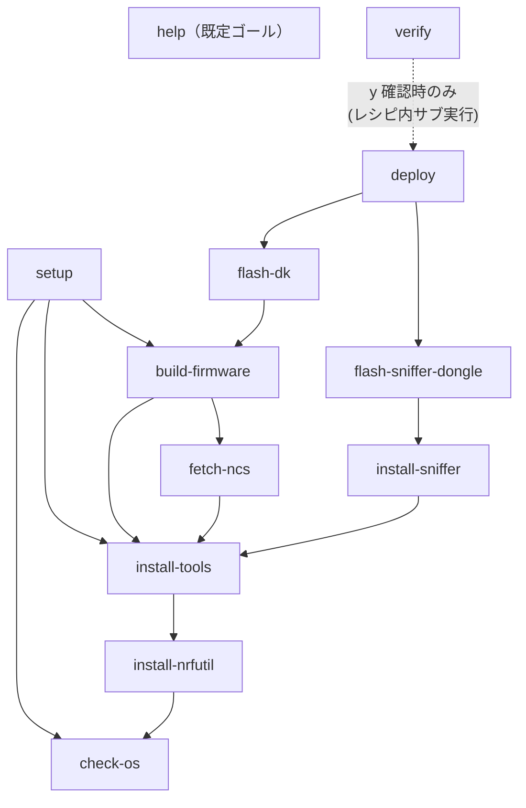

# DESIGN-001 環境構築 Makefile 設計書

> Core Bluetooth 検証環境を冪等に構築する自動化レイヤの設計
>
> | 項目 | 内容 |
> | --- | --- |
> | Doc ID | DESIGN-001 |
> | 日付 | 2026-06-02 |
> | 対象 | Apple Silicon Mac |

**スコープ:** nRF Connect SDK、Wireshark、nRF Sniffer、Python 依存、ファームウェア書き込みまでの一連の環境構築を Make ターゲットとして定義する。

**対象外:** Xcode および iOS 実機署名の自動化は対象外とする。Apple の署名フローは GUI 操作と手動承認を要するため、Make の冪等性が保証できないことが理由である。

## 章立て

| No | 章 | 目標規定文 |
| --- | --- | --- |
| 1 | 概要 | 本設計書が定義する対象と、Makefile を採用する理由を述べる。 |
| 2 | 冪等性の定義と担保方式 | 本設計における冪等性の定義と、それを Make でどう実現するかを述べる。 |
| 3 | ターゲット設計 | 各 Make ターゲットの責務と依存関係を定義する。 |
| 4 | 変数とガード設計 | 環境差を吸収する変数と、再実行時の安全性を担保するガード条件を定義する。 |
| 5 | 依存グラフ | ターゲット間の依存関係を有向グラフとして示す。 |
| 6 | 失敗時の挙動 | 各ターゲットが失敗した場合の回復方針を定義する。 |
| 7 | 結論 | 本設計の要点と、実装フェーズへの引き継ぎ事項をまとめる。 |
| — | 意思決定ログ | 解決した選択を一元的に記録し、二度蒸し返さない。 |

## 1. 概要

本設計書は、Core Bluetooth 検証環境の構築を Make ターゲットとして定義し、何度実行しても同一の最終状態に収束する自動化レイヤを設計するものである。

Make を採用する理由は三点ある。第一に、ターゲット間の依存関係を宣言的に記述でき、必要なタスクのみが実行される点。第二に、シェルスクリプトの羅列と比較して、再実行時の差分制御を構造的に表現できる点。第三に、追加のランタイムを要さず、macOS に標準搭載される点である。

## 2. 冪等性の定義と担保方式

本設計における冪等性とは「同一の入力に対し、Make ターゲットを何度実行しても最終状態が変化しない」ことと定義する。これを担保する方式は、各ターゲットの冒頭で現在状態を検査し、目標状態と一致する場合は副作用のある処理を実行しないことである。

| ガード条件 | 判定方法 | 効果 |
| --- | --- | --- |
| ツール存在検査 | `command -v` または対応するバージョン問い合わせコマンドの終了コード | 導入済みなら導入処理をスキップ |
| ファイルハッシュ比較 | 配置元と配置先の `shasum` を比較 | 一致時は再配置しない |
| ビルド差分検査 | `west build` のインクリメンタル機構 | ソース未変更時は再コンパイルしない |
| デバイス接続検査 | シリアルポート / J-Link の存在確認 | 未接続時は明示エラーで即停止 |

> ファームウェア書き込みは厳密には非冪等な操作である。ただし、同一ファームウェアの再書き込みはデバイスの結果状態を変えないため、本設計では実質的に冪等とみなす（→ 意思決定ログ DL-1）。

## 3. ターゲット設計

すべてのターゲットは `.PHONY` 指定とし、同名ファイルの有無に挙動が左右されないようにする。**既定ゴールは副作用を持たない `help`** とし、導入・ビルド・実機書き込みを伴う `setup` は明示的に `make setup` と打たせる（→ 意思決定ログ DL-3）。

| ターゲット | 依存先 | 責務 | 冪等性の担保 |
| --- | --- | --- | --- |
| `help` | — | **既定ゴール。** 各ターゲットの `## 注記` から一覧を自動生成して表示する。副作用を持たない。 | 読み取り専用。状態を変更しない。 |
| `setup` | check-os, install-tools, build-firmware | **ソフトウェア環境構築（実機不要）。** 前提確認→ツール導入→ファームウェアビルドまでをソフト工程のみで一括実行する（明示呼び出し）。実機書き込みは `deploy`、検証は `verify` が担う（→ DL-9）。各依存ターゲットが個別に冪等であるため setup の再実行も冪等。 | 依存先がすべて冪等であることに依存する。setup 自体は状態を持たない。 |
| `deploy` | flash-dk, flash-sniffer-dongle | **実機へファームウェアを書き込む（要 DK＋ドングル接続）。** 書き込み（副作用あり）のみを担い、検証は読み取り専用の `verify` に分離する（→ DL-9）。非並列 make では prerequisite が左→右順に実行されるため flash-dk→flash-sniffer-dongle の順に走る。検証まで続けたい場合は `make deploy verify` と並べて指定する。 | 依存先がすべて（実質）冪等であることに依存する。deploy 自体は状態を持たない。 |
| `check-os` | — | 実行環境が Apple Silicon Mac であることを確認する。`uname -m` が arm64 を返すこと、Homebrew が存在することを検査する。 | 読み取り専用の検査のみ。本質的に冪等。 |
| `install-nrfutil` | check-os | nrfutil 本体を Nordic 公式 arm64 バイナリの直接取得で導入する（最も壊れやすい工程を独立化し、CI が本工程だけを実機検証できるようにする → DL-4, DL-6）。 | 判定を `nrfutil --version` の終了コードで行い、壊れた symlink を誤検出しない。導入済みならスキップ。 |
| `install-tools` | install-nrfutil | nrfutil サブコマンド(toolchain-manager / device / nrf5sdk-tools) / NCS Toolchain / Wireshark / Python 依存(west) / **nrfjprog ＋ SEGGER J-Link** を導入する。各ツールの導入有無を事前検査し、未導入のもののみ導入する。`nrf5sdk-tools` は `flash-sniffer-dongle` の DFU 書き込みに必須（→ DL-5）。nrfjprog ＋ J-Link は `flash-dk` の J-Link 書き込みに必須（→ DL-11）。 | 導入前に存在検査。導入済みならスキップし重複導入が発生しない。nrfutil 本体の判定は `nrfutil --version`、nrfjprog は `nrfjprog --version`、各 nrfutil サブコマンドは `nrfutil <cmd> --help` の終了コードで行い、壊れた symlink を誤検出しない。 |
| `install-sniffer` | install-tools | nRF Sniffer の extcap プラグインを Wireshark のプラグインディレクトリへ配置する。 | 配置先のファイルハッシュを比較し、一致時は再配置しない。 |
| `fetch-ncs` | install-tools | nRF Connect SDK のソースツリー（`nrf/`・`zephyr/`・`samples/` 等）を `west init` + `west update` で `$(NCS_BASE)` に取得する。`install-tools` はツールチェインのみを入れソースを取得しないため、`build-firmware` が要する `SAMPLE_DIR` を本ターゲットが供給する（→ DL-7）。数 GB のダウンロードを伴う。 | `SAMPLE_DIR` か west workspace（`$(NCS_BASE)/.west`）の存在を検査し、取得済みならスキップする。 |
| `build-firmware` | install-tools, fetch-ncs | peripheral_uart サンプルをビルドする。ソースツリーは `fetch-ncs` が事前取得する。 | `west build` のインクリメンタルビルド機構に委ねる。ソース未変更時は再コンパイルしない。 |
| `flash-dk` | build-firmware | ビルド済みファームウェアを開発キットへ書き込む。J-Link を検出し、未接続時は明示エラーで停止する。 | 同一ファームウェアの再書き込みは結果状態を変えないため実質冪等。 |
| `flash-sniffer-dongle` | install-sniffer | USB ドングルへ nRF Sniffer ファームウェアを書き込む。Open Bootloader 経由の DFU を用いる（hex→署名付き DFU zip 変換→シリアル転送）。使用コマンドは新 unified nrfutil の `nrf5sdk-tools`（→ DL-5）。 | 同一ファームウェアの再書き込みは結果を変えない（実質冪等）。生成 zip は毎回 `rm -f` してから再生成する。 |
| `verify` | —（実行時にサブ実行） | フルフローの入口。まず `[y/N]` 確認を出し、`y` のときだけ `deploy`（実機書き込み）を実行する。その後、DK が BLE Peripheral として広告していること・Wireshark に Sniffer インタフェースが出現していることを検査する（→ DL-10）。`y` 以外なら書き込みをスキップして現在の状態を検査する。 | 検査自体は読み取り専用。書き込みは確認（既定 N）を経た場合のみ実行する。`deploy` を make 依存ではなくレシピ内サブ実行で呼ぶため、確認をフラッシュ前に出せる。 |
| `clean` | — | ビルド成果物を削除する。導入済みツールや書き込み状態には干渉しない。 | 対象が存在しない場合も `rm -rf` により正常終了する。 |

## 4. 変数とガード設計

環境差を吸収する変数。いずれもコマンドライン引数での上書きを許容し、未指定時は安全側の既定値を採る。

| 変数 | 既定値 | 用途 |
| --- | --- | --- |
| `NCS_VERSION` | `v2.6.1` | nRF Connect SDK のバージョン固定。バージョン不整合に起因するビルド失敗を防ぐ。 |
| `BOARD` | `nrf52840dk_nrf52840` | ビルド対象ボードの指定。 |
| `SNIFFER_HEX` | 配布物のパス | Sniffer ファームウェアのパス。nRF Sniffer 配布物のバージョンに追随する。 |
| `WIRESHARK_EXTCAP_DIR` | `~/.local/lib/wireshark/extcap` | extcap プラグインの配置先（macOS のユーザー領域パス）。 |
| `SERIAL_PORT` | 自動検出 | 書き込み対象シリアルポート。未指定時は自動検出を試み、複数検出時はエラーで停止する。 |

## 5. 依存グラフ

矢印は「依存元 → 依存先」を表し、依存先が先に実行される。`help` は既定ゴールだが依存を持たない独立ノードである。

## 6. 失敗時の挙動

失敗時は副作用を残さず即停止し、再実行により回復可能な状態を保つ。

| ターゲット | 失敗条件 | 回復方針 |
| --- | --- | --- |
| `check-os` | arm64 でない、または Homebrew 不在 | 明示メッセージを出力し即停止。後続を実行しない。 |
| `install-tools` | ネットワーク断、バージョン取得失敗 | 失敗ツール名を表示。再実行で導入済み分はスキップし未導入分のみ再試行。 |
| `fetch-ncs` | `west init` / `west update` がネットワーク断・manifest 不在で失敗 | ネットワーク / manifest（`--mr $(NCS_VERSION)`）確認と Nordic 公式手順 URL を案内。途中失敗時は `$(NCS_BASE)` を削除して再実行する旨を提示。 |
| `build-firmware` | サンプル不在（NCS ソース未取得）／SDK と Toolchain のバージョン不整合 | サンプル不在時は `make fetch-ncs` の実行・手動 west コマンド例・公式手順 URL を案内。ビルド失敗時は west のエラーログと `NCS_VERSION` の固定値を確認する旨を案内。 |
| `flash-dk` | 開発キット未接続、シリアルポート曖昧 | 検出結果を表示し停止。`SERIAL_PORT` の明示指定を促す。 |
| `verify` | 広告未検出、Sniffer インタフェース不在 | どの検査が失敗したかを表示。フラッシュ未実施が疑われる場合は `make deploy`（flash 系ターゲット）の実行を案内。 |

## 7. 結論

本設計の要点は、各ターゲットを状態検査つきの冪等な単位として定義し、依存グラフによって必要最小限の実行に限定することである。これにより、環境構築を何度繰り返しても同一の最終状態へ収束する。

実装フェーズへの引き継ぎ事項:

1. ファームウェア書き込みの冪等性は物理的摩耗を無視する前提に立つため、頻繁な再書き込みを伴う運用では別途検討を要する（DL-1）。
2. Xcode 側の署名フローは本 Makefile の対象外であり、手動手順として別途記録する必要がある。

## 意思決定ログ

解決した選択を一元的に記録する。自律判断・エスカレーションを問わず、ここに集約して同じ論点を二度と蒸し返さない。

| ID | 決定事項 | 理由 / 背景 | 種別 |
| --- | --- | --- | --- |
| DL-1 | ファームウェア書き込みを「実質冪等」とみなす | 同一 FW の再書き込みは結果状態を変えない。書き込み回数に依存する物理的摩耗は無視できるという前提に基づく（意見）。 | 設計前提 |
| DL-2 | 各レシピを単一シェルチェーンに集約する | macOS 標準の GNU Make 3.81 は `.ONESHELL` / `.SHELLFLAGS` を非対応（3.82+ で追加）。レシピ行をまたいだシェル変数共有は壊れるため、検査ロジックを 1 シェルに閉じる。`gmake` 3.82+ でも整合。 | 実装制約 |
| DL-3 | 既定ゴールを `setup` から `help` に変更する | 当初設計は「先頭ターゲット＝既定」の慣習に従い `setup` を既定にしていたが、素の `make` が導入・ビルド・**実機書き込み**まで一括実行するのは誤実行の事故リスクが高い。副作用のない `help` を既定にし、一括実行は明示 `make setup` に限定する。これはモダンな Makefile の慣習（self-documenting help）にも合致する。 | UX / 既定挙動（ユーザー承認済み） |
| DL-4 | nrfutil を Homebrew cask ではなく Nordic 公式バイナリの直接取得で導入する | `brew install --cask nrfutil` は **deprecated かつ macOS Gatekeeper チェックに失敗**し、実体バイナリを伴わない壊れた symlink を残す（`brew` は「installed」と記録するが `nrfutil` は実行不可）。これにより `make setup` が `command not found` (Error 127) で失敗した。対策として、Nordic 公式 Artifactory (`files.nordicsemi.com`) の arm64 ネイティブバイナリを `curl -fL` で取得し、`chmod +x` + quarantine 除去のうえ `$(brew --prefix)/bin` へ配置する（sudo 不要）。導入判定は `command -v` ではなく `nrfutil --version` の終了コードで行い、壊れた symlink を「導入済み」と誤検出しない。 | 実装バグ修正（実機検証で発覚） |
| DL-5 | ドングルの DFU を旧 `nrfutil pkg` / `nrfutil dfu` ではなく新 unified nrfutil の `nrf5sdk-tools` コマンドで行う | DL-4 で導入した新 unified nrfutil（arm64 公式バイナリ）には旧 pc-nrfutil の `pkg` / `dfu` サブコマンドが**存在しない**（別コマンド体系）。旧構文のままでは `flash-sniffer-dongle` が実機接続時に失敗する。Nordic は旧 pc-nrfutil（`pip install nrfutil`）を **deprecated** とし、当該機能は `nrfutil install nrf5sdk-tools` で導入する `nrfutil nrf5sdk-tools pkg generate` / `nrfutil nrf5sdk-tools dfu usb-serial` へ移行している。これは旧構文の 1:1 後継であり、既存ターゲットのシリアルポート自動検出・`SERIAL_PORT` 指定・複数検出エラーをそのまま温存できるため採用した。 **代替案:** Nordic 推奨の `nrfutil device program --firmware <zip> --traits nordicDfu`（DFU トレイトで自動探索、ポート指定不要）。`pkg generate` は同じく `nrf5sdk-tools` が必要。今回は tty ポート検出ロジックの維持と最小差分を優先し不採用。 **前提:** ドングルは RESET ボタンで Open Bootloader(LED 赤点滅)に入り `/dev/tty.usbmodem*` で列挙される。ブートローダは raw hex を受け付けないため、必ず署名付き DFU zip に変換してから転送する。 一次情報: nRF Sniffer programming ([docs.nordicsemi.com](https://docs.nordicsemi.com/bundle/nrfutil/page/nrfutil-ble-sniffer/guides/programming_firmware.html)) / nrf5sdk-tools install・pkg・dfu ([install](https://docs.nordicsemi.com/bundle/nrfutil/page/nrfutil-nrf5sdk-tools/guides/installing.html) / [pkg](https://docs.nordicsemi.com/bundle/nrfutil/page/nrfutil-nrf5sdk-tools/guides/dfu_generating_packages.html) / [dfu](https://docs.nordicsemi.com/bundle/nrfutil/page/nrfutil-nrf5sdk-tools/guides/dfu_performing.html)) / device program over DFU ([docs](https://docs.nordicsemi.com/bundle/nrfutil/page/nrfutil-device/guides/programming_dongle_nsdfu.html)) / Zephyr nRF52840 Dongle board doc（`nrf5sdk-tools dfu usb-serial` を明記）([docs.zephyrproject.org](https://docs.zephyrproject.org/latest/boards/nordic/nrf52840dongle/doc/index.html)) / pc-nrfutil 廃止告知 ([github](https://github.com/NordicSemiconductor/pc-nrfutil)) | 実装バグ修正（API 移行） |
| DL-6 | nrfutil 本体導入を独立ターゲット `install-nrfutil` に切り出し、CI で実機 smoke test する | DL-4 の bug は CI が **dry-run（`make -n`）と read-only ターゲットのみ**を検証し、`install-tools` を一度も実行していなかったため見逃された。最も壊れやすい工程（外部バイナリ取得）を独立ターゲットにし、macos-14 ランナーで `make install-nrfutil` を実行して `nrfutil --version` の起動と冪等性を検証する。NCS Toolchain 本体（数 GB）は重いため CI 対象外。public リポジトリのため標準 macOS ランナーは無料（課金ゼロ）。 | テスト戦略 / CI 検証範囲 |
| DL-7 | NCS ソースツリー取得を独立ターゲット `fetch-ncs` で自動化し、全ターゲットの失敗メッセージを「何が・なぜ・どう直すか（具体コマンド/URL）」を含む形に親切化する | **実機で `make setup` の `build-firmware` が「サンプルが見つかりません: …/peripheral_uart」で失敗した。** 根本原因は、`install-tools` の `nrfutil toolchain-manager install --ncs-version` が **ツールチェイン（コンパイラ・Zephyr 依存）のみ**を導入し、`nrf/`・`zephyr/`・`samples/` を含む **NCS ソースツリー（`west init` + `west update` で `~/ncs/<ver>` に展開される）を取得していなかった**こと。`SAMPLE_DIR` が存在せずビルドが落ちていた。 **対策:** 新ターゲット `fetch-ncs`（依存: `install-tools`）を追加し、`build-firmware: fetch-ncs` で配線。これにより `make setup` が自動でソース取得→ビルドまで通る。冪等ガードは `SAMPLE_DIR` か `$(NCS_BASE)/.west` の存在で判定。取得は install-tools が入れた nrfutil toolchain-manager 環境内で Nordic 公式手順どおりに行う。**数 GB DL のため CI では smoke 実行せず dry-run パースのみ。** **採用コマンド（Nordic 公式 install_ncs 手順の verbatim。推測ではない）:** 1) `nrfutil toolchain-manager launch --ncs-version $(NCS_VERSION) -- west init -m https://github.com/nrfconnect/sdk-nrf --mr $(NCS_VERSION) $(NCS_BASE)` 2) `nrfutil toolchain-manager launch --ncs-version $(NCS_VERSION) -- /bin/bash -c 'cd $(NCS_BASE) && west update && west zephyr-export'` `west update` / `west zephyr-export` は workspace 内で実行する必要があるため `cd $(NCS_BASE)` してから実行する。`launch -- <cmd>` の単一コマンド実行形は既存 `build-firmware` の `west build` と同形で、workspace 操作の複数コマンドは公式 nrf-docker と同様 `/bin/bash -c '...'` に包む。`west init` の末尾 topdir 引数は Zephyr west の `west init [directory]` 仕様に準拠。 **エラーメッセージ親切化:** `build-firmware`（サンプル不在→`make fetch-ncs` 実行案内＋手動 west コマンド例＋公式 URL）、`fetch-ncs`（ネットワーク/manifest 確認＋URL）、`flash-dk`（nrfjprog 不在→nRF Command Line Tools DL URL）、`install-sniffer`/`flash-sniffer-dongle`（配布物未展開→nRF Sniffer DL URL＋展開手順）。 一次情報: NCS install ([docs.nordicsemi.com/.../install_ncs.html](https://docs.nordicsemi.com/bundle/ncs-latest/page/nrf/installation/install_ncs.html)、source rst: [github.com/nrfconnect/sdk-nrf](https://github.com/nrfconnect/sdk-nrf/blob/main/doc/nrf/installation/install_ncs.rst)) / west init+launch 実例 ([NordicPlayground/nrf-docker](https://github.com/NordicPlayground/nrf-docker/blob/saga/Dockerfile)) / nRF Sniffer ([nordicsemi.com](https://www.nordicsemi.com/Products/Development-tools/nRF-Sniffer-for-Bluetooth-LE)、[install guide](https://docs.nordicsemi.com/bundle/nrfutil/page/nrfutil-ble-sniffer/guides/installing_nrf_sniffer.html)) / nRF Command Line Tools ([nordicsemi.com](https://www.nordicsemi.com/Products/Development-tools/nRF-Command-Line-Tools/Download)) | 実装バグ修正（実機検証で発覚）＋ UX |
| DL-8 | `build-firmware` の `west build` を west ワークスペース内で実行する（`cd $(NCS_BASE)` してから呼ぶ） | **実機で `build-firmware` が `west: unknown command "build"; do you need to run this inside a workspace?` で失敗した。** `west build` は west の**ワークスペース拡張コマンド**で、`.west/` を持つワークスペース（`$(NCS_BASE)`）の内側でしか解決されない。従来レシピはリポジトリ CWD（ワークスペース外）から `west build` を実行していたため認識されなかった。 **対策:** `nrfutil toolchain-manager launch ... -- /bin/bash -c 'cd "$(NCS_BASE)" && west build -b $(BOARD) "$(SAMPLE_DIR)" --build-dir "$(BUILD_DIR)"'` とし、ワークスペース内で実行する（`fetch-ncs` の `west update` と同じ `cd` パターン）。`SAMPLE_DIR`・`BUILD_DIR` は絶対パスのため成果物はリポジトリの `build/` に出力される。一次情報: west build はワークスペース拡張コマンド（[docs.zephyrproject.org/latest/develop/west/build-flash-debug.html](https://docs.zephyrproject.org/latest/develop/west/build-flash-debug.html)）。 | 実装バグ修正（実機検証で発覚） |
| DL-9 | `make` のインターフェースを 3 つの関心に分離する（`setup`=実機不要のソフト工程／`deploy`=実機への書き込み（副作用）／`verify`=読み取り専用の検査） | **従来 `setup` は末尾に `verify`（→`flash-dk`/`flash-sniffer-dongle`）を従え、物理デバイス（nRF52840 DK / Dongle）と J-Link/nrfjprog に依存していたため、実機なしでは完走できなかった。** 環境構築の完了確認（ツール導入＋ファームウェアビルドが通るか）すら実機が無いと検証できない状態だった。 **対策:** `setup` をハードウェア非依存部分のみ（`check-os install-tools build-firmware`）に絞り、実機が無くても完走させる。実機への**書き込み**は新ターゲット `deploy`（`flash-dk flash-sniffer-dongle`）へ分離。 **書き込みと検証の分離:** `deploy`（書き込み＝副作用あり）と `verify`（検査＝読み取り専用）はインターフェースとして別物であり、`deploy` に `verify` を混ぜるのは不適切なため、`verify` を `deploy` の依存に含めず独立ターゲットとした（フラッシュ済み前提）。両方続けて行いたい場合は `make deploy verify` と並べて指定する。`verify` から `flash` 依存を外したことで、`.PHONY` ターゲットの二重実行（flash-dk が複数回走る）も同時に回避している。 **CI 追従:** parse-lint の依存グラフ検証を 3 系統（`make -n setup` はソフト工程 needle のみ・flash/verify 不在も確認／`make -n deploy` は flash needle・verify 不在も確認／`make -n verify` は verify needle）に分割した。 | UX / インターフェース設計（ユーザー指摘・承認済み） |
| DL-10 | `verify` を「確認付きフルフローの入口」にする（`[y/N]` 確認 → `y` なら `deploy`（書き込み）→ 検査） | DL-9 で `verify` を独立させた後、ユーザーから「`verify` のフロー内で `deploy` してよい。ただし実機書き込み前に『書き込みが行われます。問題ないですか？』と確認し、`y` のときだけ実施したい」との指摘。検査だけでなく書き込みまで一気通貫したいが、書き込みは副作用なので明示同意を取る。 **実装:** 確認は make の prerequisite では出せない（prerequisite はレシピより先に走り、確認前に書き込まれてしまう）。よって `verify` のレシピ内で `printf`＋`read` の確認を行い、`y` のときだけ書き込みをサブ実行する。`deploy` 自体は無確認の素の書き込みターゲットとして残し、`verify` がそれを呼ぶ（target レベルでは依然分離。DL-9 と矛盾しない）。`y` 以外は書き込みをスキップし現在状態を検査する（既定 N）。非対話時は `/dev/tty` 不在で自動的にスキップ。 **重要（dry-run 保全）:** サブ実行に `$(MAKE)` を使うと、その行は `make -n`（dry-run）でも実行され確認プロンプトが誤って出る。これを避けるため**あえて literal `make deploy`** を用いる（literal `make` を含む行は `-n` で実行されず印字のみ）。`make -n verify` が真の dry-run（プロンプト無し・再帰無し）であることを機械確認済み。 **CI:** `make -n verify` は literal `make` のため flash を再帰展開せず、依存グラフ検証ステップは従来どおり `verify: 構築結果` needle で成立する。 | UX / インターフェース設計（ユーザー指摘・承認済み） |
| DL-11 | ホストツール（nrfjprog ＋ SEGGER J-Link）を `install-tools`（＝`make setup`）で自動導入する | DL-9 で setup をソフト/ハードに分割した後、実機書き込み段で `flash-dk` が `nrfjprog 不在`／`JLinkARM DLL not found` で止まり、ユーザーから「ホストツールはソフト導入なのだから `make setup` が入れるべき（手動はおかしい）」との指摘。**当初ユーザーは「ツール自動導入なし（split のみ）」を選んでいたが、実運用で手動導入の手間が顕在化したため方針変更。** nrfjprog と J-Link は実機が無くても入る純粋なソフト導入なので `install-tools`（ソフト工程）に含めるのが適切。 **実装:** `nrfjprog --version` の終了コードで判定し、未導入なら `brew install --cask nordic-nrf-command-line-tools` を実行。この cask は依存として `segger-jlink` を連れてくるため 1 つで nrfjprog ＋ J-Link が揃う（実機調査で確認）。いずれも `.pkg` インストーラのため導入時に sudo を要求し得る（一度きり・対話）。 **CI 非実行:** install-tools は CI で実行しない（dry-run パースのみ）ため、sudo/実インストールは CI に影響しない。 **残課題:** nRF Sniffer 配布物は Nordic のダウンロードページ越し（安定した直 URL が無い）のため自動取得は見送り、手動配置のまま明示案内する。 | UX / 自動化（ユーザー指摘・方針変更） |

> **注:** DL-4 のダウンロード URL は調査時に実機で取得・`file` により arm64 ネイティブと確認済み（推測 URL ではない）。なお `nrfutil` バイナリの取得・実行はユーザー自身が `make` を実行する際にユーザー権限で行われる。`flash-sniffer-dongle` が用いる `nrfutil pkg` / `nrfutil dfu` は旧 pc-nrfutil 系の構文であり、新 unified nrfutil では別コマンド体系になる点は **DL-5 で対応済み**（`nrfutil nrf5sdk-tools` 系へ移行）。

> **注:** DL-3 は当初設計（`setup` を既定として冒頭配置）からの逸脱である。実装・レビュー段階でのユーザー判断により決定し、本設計書を実装に追従させた。
